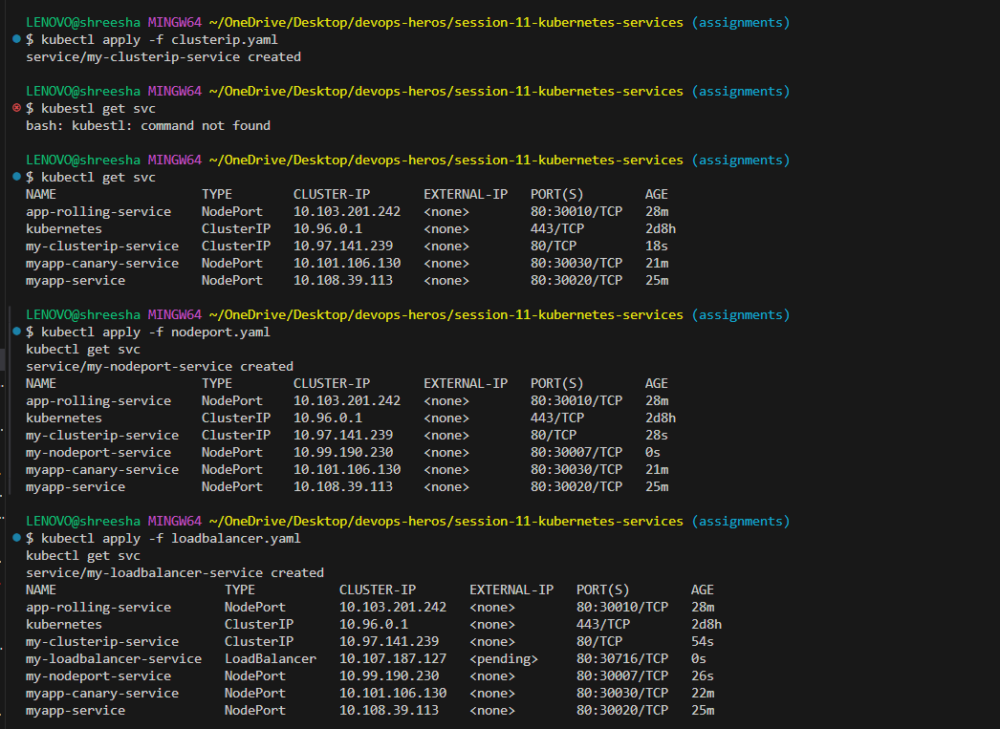
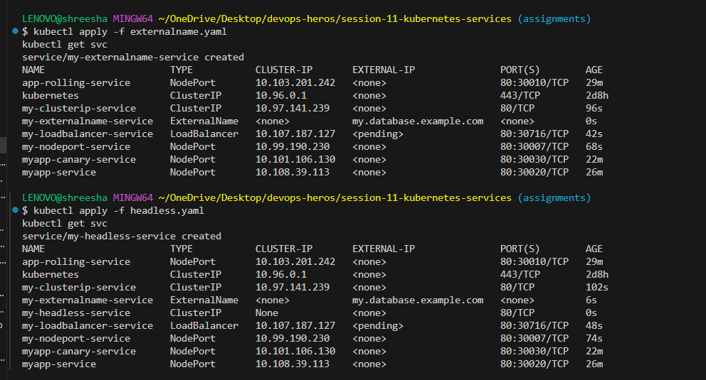

# Session 11: Kubernetes Networking & Services

## Task 1: Kubernetes Services

Below are the 5 types of Kubernetes services and instructions on how to run them. The corresponding YAML files can be created in your workspace.

### 1. ClusterIP
This is the default service type. It exposes the service on an internal IP in the cluster.

**Command to run:**
```bash
kubectl apply -f clusterip.yaml
kubectl get svc
```

### 2. NodePort
Exposes the service on each Node's IP at a static port.

**Command to run:**
```bash
kubectl apply -f nodeport.yaml
kubectl get svc
```

### 3. LoadBalancer
Exposes the service externally using a cloud provider's load balancer.

**Command to run:**
```bash
kubectl apply -f loadbalancer.yaml
kubectl get svc
```

### 4. ExternalName
Maps the service to the contents of the `externalName` field (e.g. `foo.bar.example.com`).

**Command to run:**
```bash
kubectl apply -f externalname.yaml
kubectl get svc
```

### 5. Headless Service
A service with `clusterIP: None`, used for direct pod discovery without load balancing.

**Command to run:**
```bash
kubectl apply -f headless.yaml
kubectl get svc
```

---

## Task 2: Kubernetes Object Comparison

### Deployment vs ReplicaSet

- **Purpose**: A ReplicaSet ensures that a specified number of pod replicas are running at any given time. A Deployment provides declarative updates for Pods and ReplicaSets.
- **Pod management**: ReplicaSets manage the lifecycle of identical pods. Deployments manage ReplicaSets, orchestrating changes between different ReplicaSets (versions).
- **Scaling**: Both can be scaled, but scaling a Deployment scales its underlying ReplicaSet.
- **Rolling updates**: Deployments support rolling updates seamlessly (creating a new ReplicaSet and slowly scaling it up while scaling down the old one). ReplicaSets do not natively handle rolling updates.
- **Relationship**: A Deployment creates and manages ReplicaSets. You should almost always use a Deployment instead of managing ReplicaSets directly.

### Deployment vs DaemonSet vs StatefulSet

- **Deployment**:
  - **Use cases**: Stateless applications (web servers, APIs).
  - **Pod creation**: Replicas can run on any available node.
  - **Scaling**: Easy scaling up and down.
  - **Networking**: Typically behind a LoadBalancer or ClusterIP service.
  - **Storage**: Ephemeral or shared persistent storage.
  - **Example**: Nginx web server, Node.js API.
- **DaemonSet**:
  - **Use cases**: Node-level infrastructure services (log collection, monitoring).
  - **Pod creation**: Ensures exactly one copy of a Pod runs on *every* (or selected) node.
  - **Scaling**: Scales automatically with the number of nodes in the cluster.
  - **Networking**: Node-level networking, host networking often used.
  - **Storage**: Usually hostPath volumes for node access.
  - **Example**: Fluentd (logging), Prometheus Node Exporter.
- **StatefulSet**:
  - **Use cases**: Stateful applications requiring unique identities and stable storage.
  - **Pod creation**: Pods are created sequentially with sticky, unique identities (e.g., `db-0`, `db-1`).
  - **Scaling**: Sequential scaling and ordered termination.
  - **Networking**: Requires a Headless Service for unique DNS entries per pod.
  - **Storage**: Unique PersistentVolumeClaim for each pod.
  - **Example**: MongoDB, Cassandra, Zookeeper.

### ReplicaSet vs Service

- **ReplicaSet responsibility**: Ensures the desired number of Pods are running and replaces failed ones. It manages the *compute* aspect.
- **Service responsibility**: Provides a stable network endpoint (IP and port) to access the dynamic Pods. It manages the *networking* aspect.
- **Why a Service is required**: Pods are ephemeral and their IP addresses change when they are recreated. A Service abstracts this and provides a static entry point.
- **How traffic reaches Pods**: Services use label selectors to identify which Pods to route traffic to, acting as an internal load balancer.
