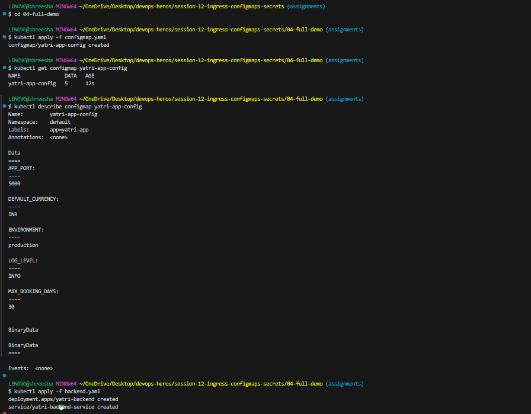
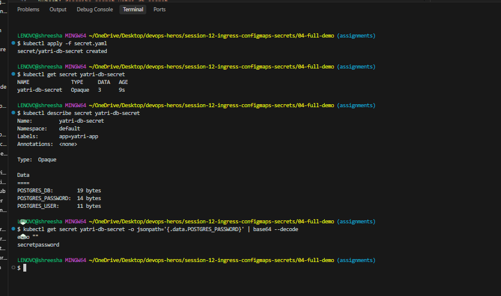
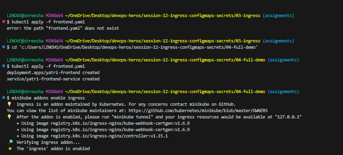
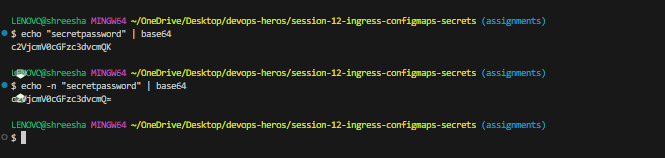

# Session 12: Kubernetes Ingress, ConfigMaps & Secrets

## Task 1: ConfigMap
**Commands to Run:**
```bash
# Navigate to the demo directory
cd 04-full-demo

# 1. Create the ConfigMap
kubectl apply -f configmap.yaml

# 2. Verify ConfigMap is created
kubectl get configmap yatri-app-config

# 3. View the stored values
kubectl describe configmap yatri-app-config

# 4. Inject into Pod and Verify (after applying backend.yaml)
kubectl apply -f backend.yaml
kubectl exec -it deployment/yatri-backend -- env | grep -E "ENVIRONMENT|LOG_LEVEL|DEFAULT_CURRENCY|POSTGRES"
```


## Task 2: Secret
**Commands to Run:**
```bash
# 1. Create the Secret
kubectl apply -f secret.yaml

# 2. Verify Secret is created
kubectl get secret yatri-db-secret

# 3. View the masked values
kubectl describe secret yatri-db-secret

# 4. Decode the password to verify
kubectl get secret yatri-db-secret -o jsonpath='{.data.POSTGRES_PASSWORD}' | base64 --decode
echo ""
```

**Why Secrets shouldn't be committed to Git:** Secrets in Kubernetes are only Base64 encoded, not encrypted. If you commit them to Git, anyone with access to the repository can easily decode the Base64 strings and compromise your sensitive data (passwords, tokens, API keys).

## Task 3: Ingress
**Commands to Run:**
```bash
# 1. Deploy the frontend application
kubectl apply -f frontend.yaml

# 2. Enable Ingress controller (if using Minikube)
minikube addons enable ingress

# 3. Configure Ingress routing
kubectl apply -f ingress.yaml

# 4. Verify Ingress has an address
kubectl get ingress yatri-ingress
kubectl describe ingress yatri-ingress

# 5. Access and verify routing
INGRESS_IP=$(kubectl get ingress yatri-ingress -o jsonpath='{.status.loadBalancer.ingress[0].ip}')
# Or if on minikube: INGRESS_IP=$(minikube ip)

# Test root path
curl -s -H "Host: yatri.local" http://${INGRESS_IP}/ | grep -i "<title>"

# Test API path
curl -s -H "Host: yatri.local" http://${INGRESS_IP}/api/
```


## Task 4: Ingress vs Ingress Controller
* **What is Ingress?** Ingress is a Kubernetes API object that defines the routing rules (HTTP/HTTPS) for managing external access to the services in a cluster. It dictates *how* traffic should be routed based on hostnames or URLs (e.g., `/api` goes to backend, `/` goes to frontend).
* **What is an Ingress Controller?** The Ingress Controller is the actual software (like NGINX, Traefik, HAProxy) that runs in the cluster, reads the rules defined by the Ingress object, and actually implements the routing.
* **Difference between them:** Ingress is just the set of rules (the blueprint). The Ingress Controller is the implementation (the traffic cop) that executes those rules. 
* **Why both are required:** An Ingress resource does nothing by itself; it needs a Controller to fulfill its rules. Conversely, a Controller needs Ingress resources to know where to route the incoming traffic.
* **Examples:**
  * **Ingress:** A YAML file with rules routing `yatri.local/api` to `backend-service`.
  * **Ingress Controller:** NGINX Ingress Controller, AWS ALB Ingress Controller, Traefik.

## Task 5: Troubleshooting (Secret Base64 Gotcha)
**Problem Identification:** 
When encoding passwords using `echo` before placing them in a `Secret`, applications (like a database) reject the password even if it seems correct.

**Root Cause:**
Standard `echo` appends an invisible newline character (`\n`) to the string before encoding it to Base64. When decoded by the pod, the password includes this newline character, making it incorrect.

**Troubleshooting Commands:**
```bash
# 1. Observe the wrong encoding (notice the Ao= at the end)
echo "secretpassword" | base64
# Output: c2VjcmV0cGFzc3dvcmQK (decodes to 'secretpassword\n')

# 2. Observe the correct encoding with the -n flag
echo -n "secretpassword" | base64
# Output: c2VjcmV0cGFzc3dvcmQ= (decodes to 'secretpassword')
```

**Fix:**
Always use `echo -n` (which suppresses the trailing newline) when encoding values for a Kubernetes Secret.
