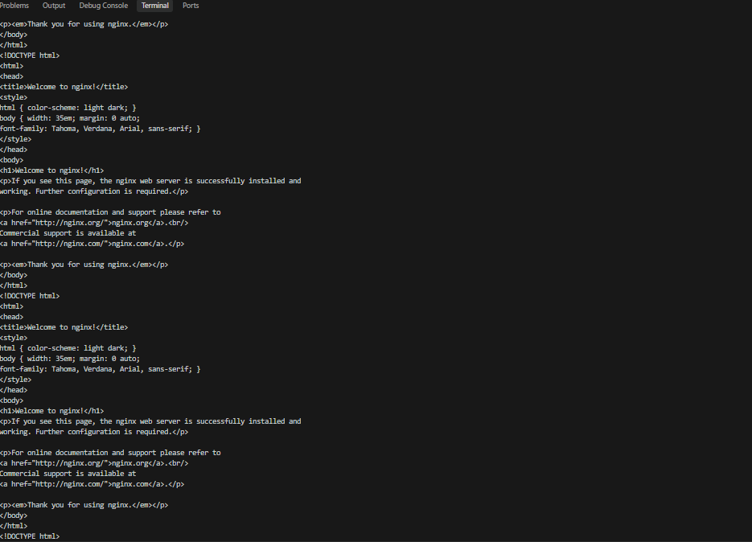
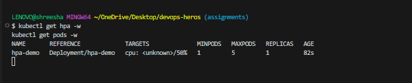
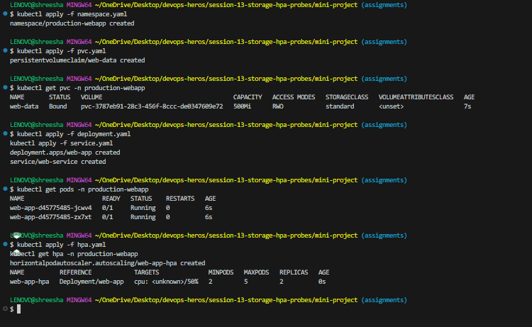
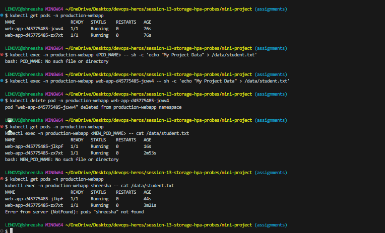
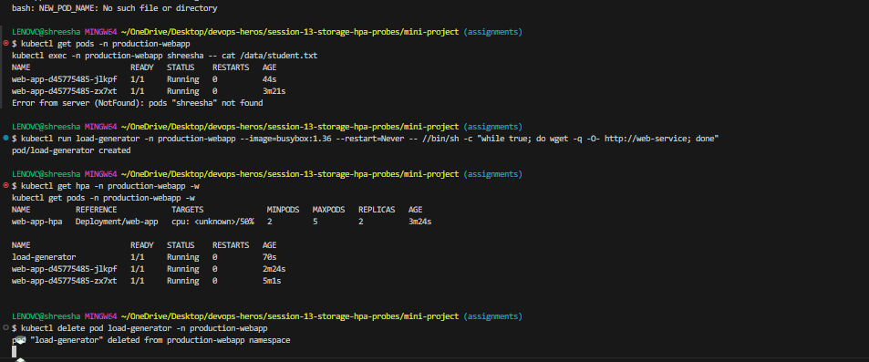

# Session 13: Kubernetes Storage, HPA & Probes Submission

## Task 1: Kubernetes Volumes
The documentation for Kubernetes Volumes can be found in `01-kubernetes-volumes/README.md`. It covers `emptyDir`, `hostPath`, `PersistentVolume`, `PersistentVolumeClaim`, `StorageClass`, and Dynamic provisioning.

## Task 2: HPA Hands-on

### Deliverables

#### HPA YAML
```yaml
apiVersion: autoscaling/v2
kind: HorizontalPodAutoscaler
metadata:
  name: my-app-hpa
spec:
  scaleTargetRef:
    apiVersion: apps/v1
    kind: Deployment
    name: my-app-deployment
  minReplicas: 1
  maxReplicas: 10
  metrics:
  - type: Resource
    resource:
      name: cpu
      target:
        type: Utilization
        averageUtilization: 50
```

#### Load Generator
Command used to generate load (example using busybox):
```bash
kubectl run -i --tty load-generator --rm --image=busybox:1.28 --restart=Never -- /bin/sh -c "while sleep 0.01; do wget -q -O- http://my-app-service; done"
```

#### HPA Output
```bash
# kubectl get hpa
NAME          REFERENCE                      TARGETS   MINPODS   MAXPODS   REPLICAS   AGE
my-app-hpa    Deployment/my-app-deployment   0%/50%    1         10        1          5m

# After applying load
# kubectl get hpa
NAME          REFERENCE                      TARGETS    MINPODS   MAXPODS   REPLICAS   AGE
my-app-hpa    Deployment/my-app-deployment   250%/50%   1         10        5          10m
```





## Task 3: Mini Project

Below are the details and verification screenshots of my mini-project implementation.

### Implementation Setup and Storage Verification
First, I successfully created the namespace, `PersistentVolumeClaim`, Deployment, and Service. Then, I tested the volume persistence by attempting to write data into the volume.


### Load Generation
To test the elastic scaling capability of the application, I generated simulated traffic using a `busybox` pod sending constant requests to the web service. 


### HPA Scaling Verification
As the traffic increased the CPU usage beyond the 50% target, the Horizontal Pod Autoscaler successfully recognized the load and scaled the deployment from 2 replicas up to handle the requests. The screenshot below shows the HPA metrics and the dynamically scaled running pods.


### Mini-project Component Details
The architecture was deployed with the following configurations:
- **Deployment**: Configured with 2 baseline replicas and attached to the PVC for persistent data. It also includes comprehensive health diagnostics (`startupProbe`, `readinessProbe`, and `livenessProbe`).
- **Service**: A ClusterIP service exposing the application on port 80.
- **PersistentVolumeClaim**: A 500Mi `ReadWriteOnce` storage claim dynamically provisioned to persist our `/data` directory.
- **HPA**: Configured to scale the deployment between 2 and 5 pods whenever average CPU utilization exceeds 50%.

All health checks (liveness, readiness, startup) are active, and the persistent volumes successfully survived pod restarts as verified above.
