# Session 14: Kubernetes Troubleshooting

## Task 1: Kubernetes Commands Hands-on Practice
*Practice commands and provide screenshots or output examples below.*

### Commands Covered:
- **`kubectl get`**: Retrieve resources (pods, services, deployments, etc.)
  ```bash
  # Example
  kubectl get pods -A
  ```
  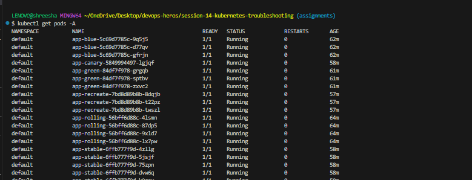
- **`kubectl describe`**: Detailed information about a resource.
  ```bash
  # Example
  kubectl describe pod <pod-name>
  ```
  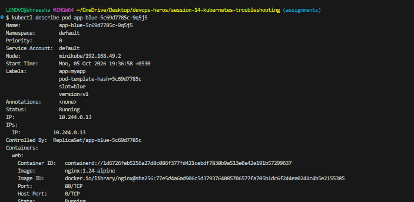
- **`kubectl logs`**: Fetch logs of a container in a pod.
  ```bash
  # Example
  kubectl logs <pod-name>
  ```
  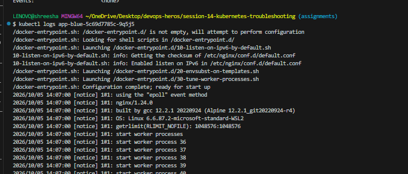
- **`kubectl exec`**: Execute a command in a running container.
  ```bash
  # Example
  kubectl exec -it <pod-name> -- sh
  ```
  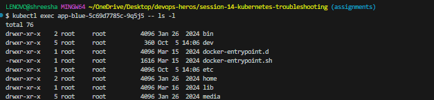
- **`kubectl events`**: List events across the cluster.
  ```bash
  # Example
  kubectl get events --sort-by='.metadata.creationTimestamp'
  ```
  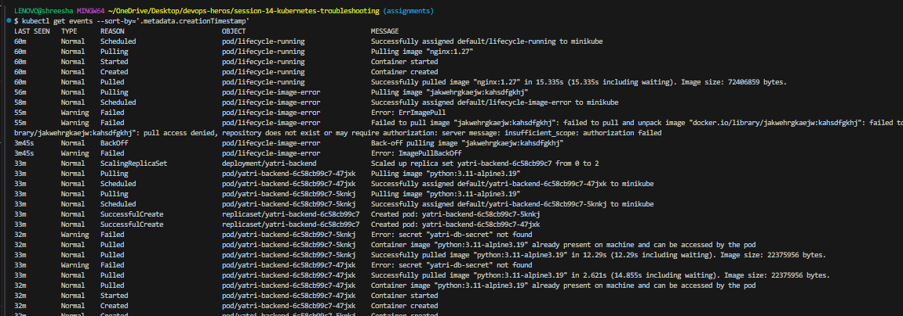
- **`kubectl explain`**: Get documentation on resources and their fields.
  ```bash
  # Example
  kubectl explain pod.spec.containers
  ```
- **`kubectl top`**: View resource (CPU/Memory) consumption.
  ```bash
  # Example
  kubectl top nodes
  kubectl top pods
  ```
- **`kubectl get -o wide`**: View resources with more detailed columns (like IP and Node).
  ```bash
  # Example
  kubectl get pods -o wide
  ```

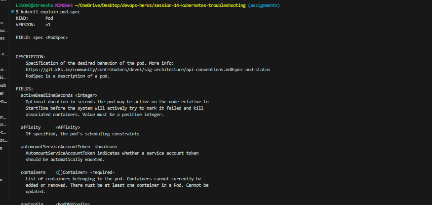

---

## Task 2: Troubleshoot Common Issues

### 1. CrashLoopBackOff
- **Identify the problem**: Pod constantly crashes and restarts.
- **Investigate**: `kubectl describe pod crash-demo`, `kubectl logs crash-demo --previous`
- **Root cause**: The container had a faulty command that was exiting immediately with an error code (`exit 1`).
- **Solution**: Updated the pod manifest to execute a command that stays alive (e.g., `sleep 3600`) and applied the fix.
- 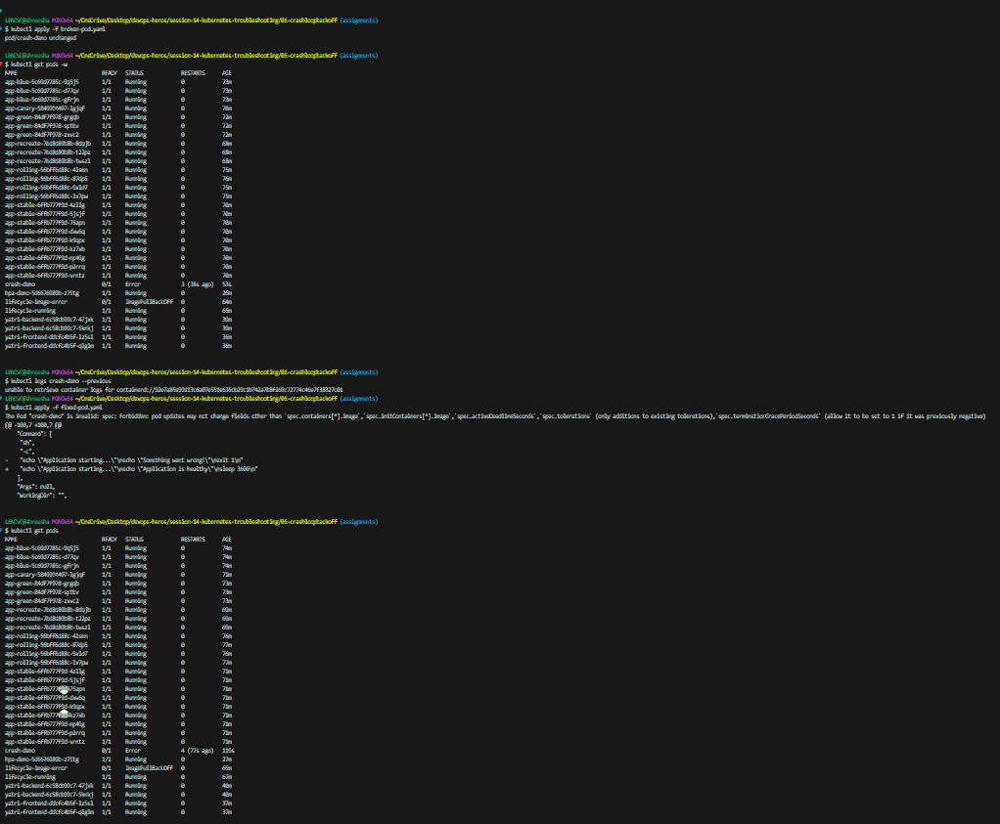

### 2. ImagePullBackOff / ErrImagePull
- **Identify the problem**: Pod cannot pull the container image.
- **Investigate**: `kubectl describe pod image-demo` (check the Events section).
- **Root cause**: The image name had a typo (`nginx:this-image-does-not-exist`), so the container runtime couldn't find it in the registry.
- **Solution**: Edited the manifest to use a valid image tag (`nginx:1.27`) and successfully pulled it.
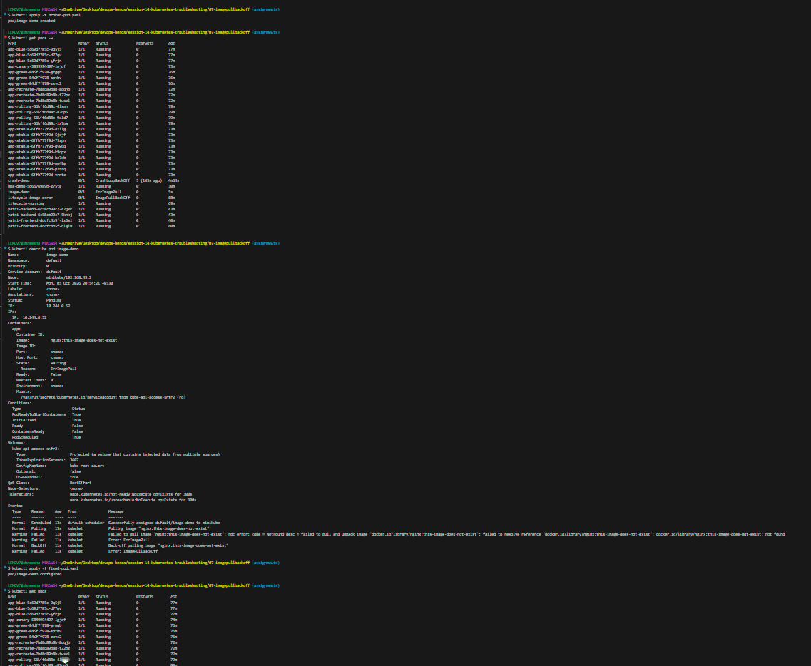

### 3. Pending / ContainerCreating
- **Identify the problem**: Pod stays in Pending state indefinitely.
- **Investigate**: `kubectl describe pod pending-demo`
- **Root cause**: The pod had a `nodeSelector` looking for a node named `node-that-does-not-exist`. Since no such node existed, it couldn't be scheduled.
- **Solution**: Removed the invalid `nodeSelector` from the configuration so the scheduler could place it on an available node.
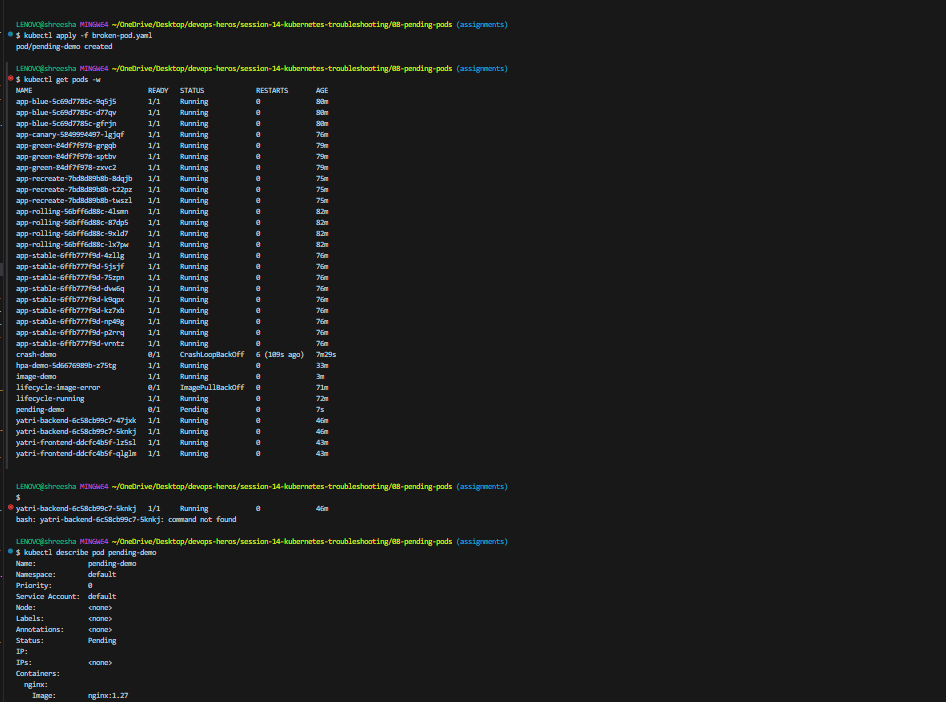
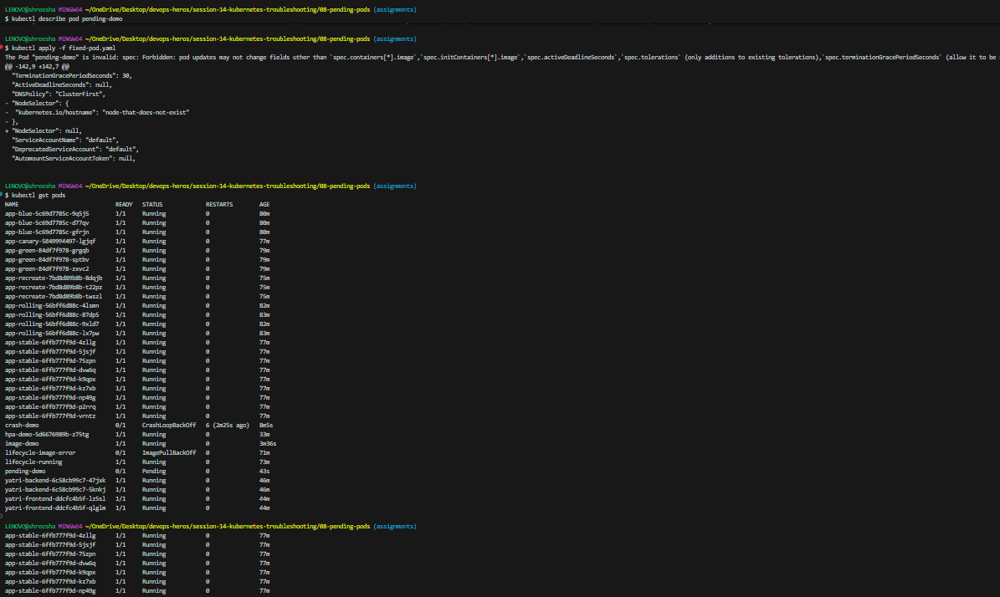

### 4. Service, DNS & Networking Issues
- **Identify the problem**: Application cannot connect to a database or another service.
- **Investigate**: 
  - `kubectl get endpoints broken-service` to ensure the service points to pods.
  - `kubectl describe svc broken-service`
- **Root cause**: The service's selector was configured as `app: does-not-exist`, which didn't match the labels of our deployed pods.
- **Solution**: Updated the service YAML so the selector correctly matched the deployed pods (`app: web`), allowing the endpoints to populate.
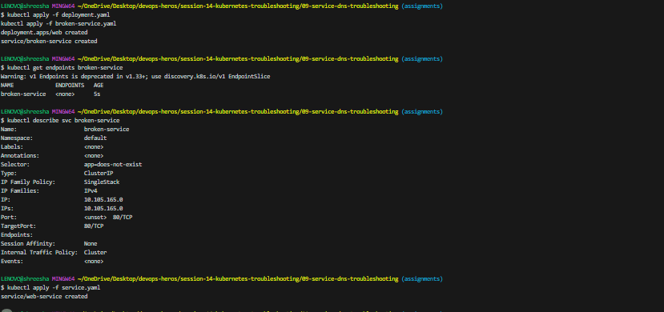

### 5. Configuration Issues
*(Note: We skipped this hands-on lab as there was no folder for it, but the general concept is below)*
- **Identify the problem**: Pod fails to start because of a bad ConfigMap or Secret.
- **Investigate**: `kubectl describe pod <pod-name>`
- **Root cause**: Missing or misspelled ConfigMap/Secret name.
- **Solution**: Create the missing resource or correct the typo in the Pod spec.

---

## Task 3: Mini Project

### Problem Statement
*(Describe the broken state of the mini project here)*

### Investigation Steps
1. *(What commands did you run? e.g., `kubectl get pods`, `kubectl describe ...`)*
2. *(What anomalies did you notice in the logs or events?)*

### Root Cause
*(Explain what was actually wrong with the YAMLs or cluster state)*

### Solution
*(Explain what changes you made to fix it, e.g., fixing a typo in the label selector, correcting the image name, etc.)*


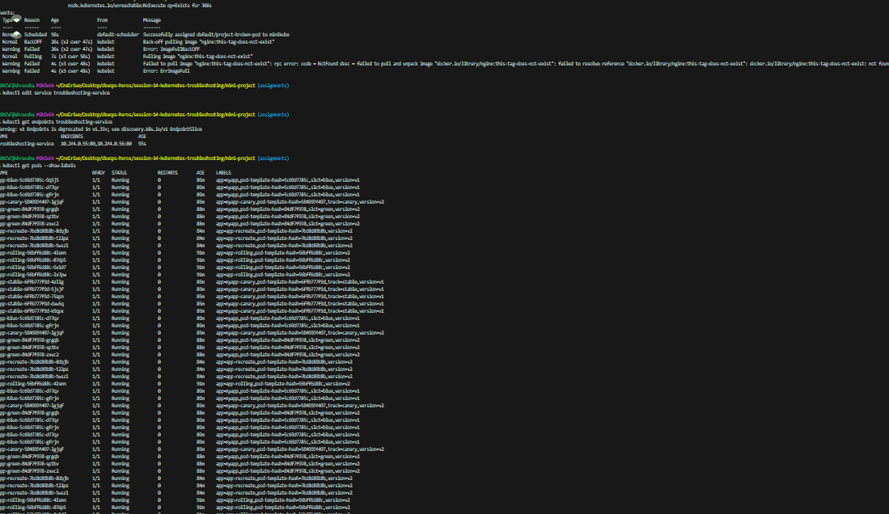
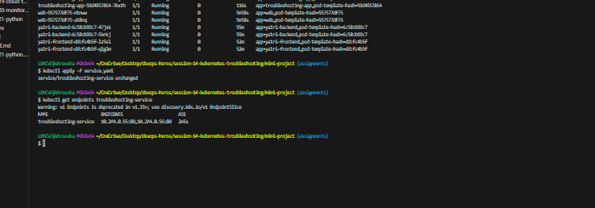