# Session 15: Helm Submission

## Task 1: Helm Commands
*(Perform hands-on practice with the following commands and capture the output/screenshots.)*

### 1. `helm create`
- **Command:** `helm create mychart`
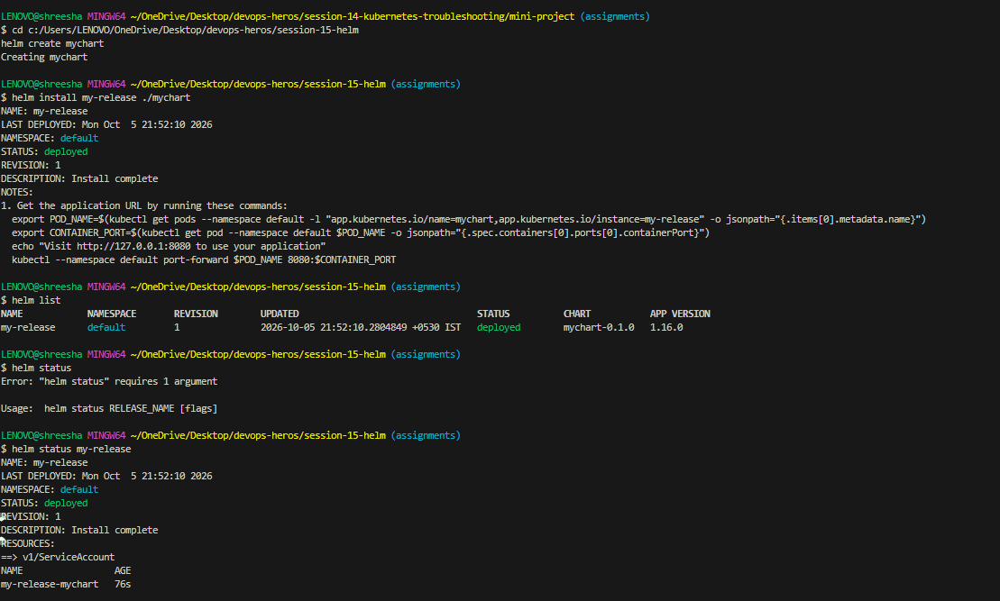

### 2. `helm install`
- **Command:** `helm install my-release ./mychart`
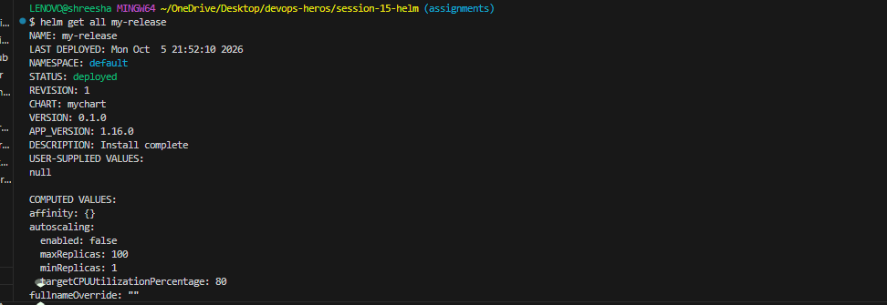

### 3. `helm list`
- **Command:** `helm list`
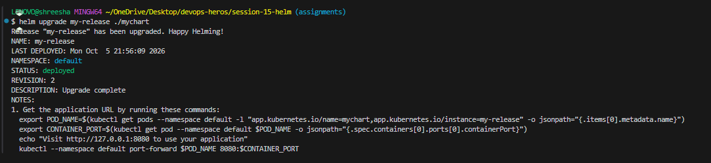

### 4. `helm status`
- **Command:** `helm status my-release`
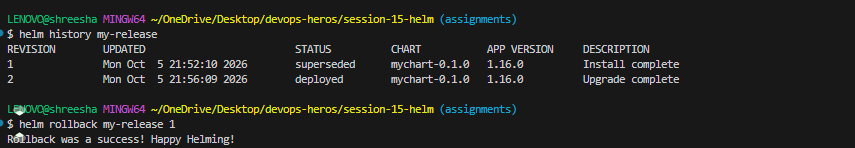

### 5. `helm get`
- **Command:** `helm get all my-release`
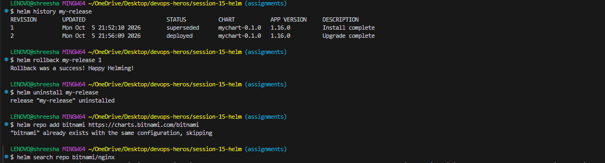

### 6. `helm upgrade`
- **Command:** `helm upgrade my-release ./mychart`
- **Output/Screenshot:**

### 7. `helm history`
- **Command:** `helm history my-release`
- **Output/Screenshot:**

### 8. `helm rollback`
- **Command:** `helm rollback my-release 1`
- **Output/Screenshot:**

### 9. `helm uninstall`
- **Command:** `helm uninstall my-release`
- **Output/Screenshot:**

### 10. `helm repo`
- **Command:** `helm repo add bitnami https://charts.bitnami.com/bitnami`
- **Output/Screenshot:**

### 11. `helm search`
- **Command:** `helm search repo bitnami/nginx`
- **Output/Screenshot:**

---

## Task 2: Helm Rollback
*(Document the complete rollback workflow.)*

### 1. Install
*(Command and Output/Screenshot)*
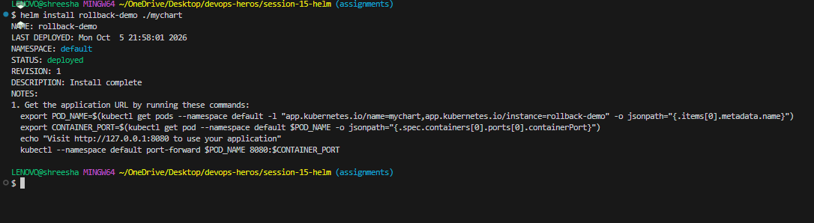

### 2. Upgrade
*(Command and Output/Screenshot)*
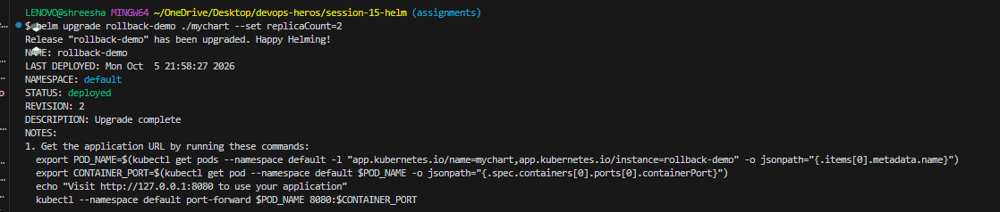

### 3. Verify
*(Command and Output/Screenshot)*
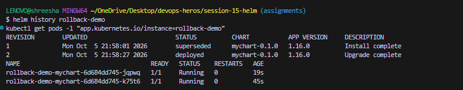

### 4. Upgrade again
*(Command and Output/Screenshot)*
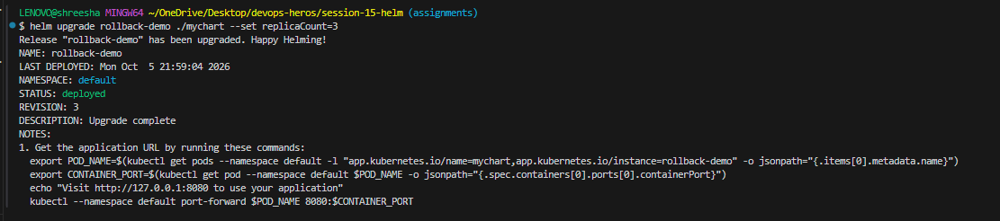

### 5. Verify
*(Command and Output/Screenshot)*
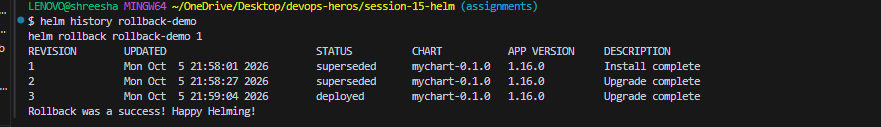

### 6. Rollback
*(Command and Output/Screenshot)*
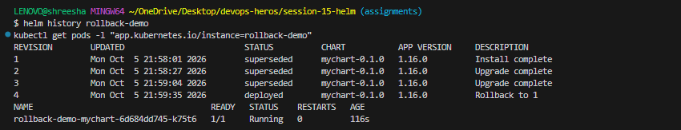

### 7. Verify
*(Command and Output/Screenshot)*

---

## Task 3: Mini Project
*(Complete the Helm mini project.)*

### Overview
*(Brief description of the mini project)*

### Helm chart
*(Include screenshots or description of your chart structure)*

### `values.yaml`
```yaml
replicaCount: 1
image:
  repository: nginx
  tag: "1.24"
service:
  port: 80
  nodePort: 30090
app:
  name: notes-app
  environment: development
```

### Templates
*We created three templates:*
1. **`deployment.yaml`**: Uses `{{ .Values.replicaCount }}` for replicas and `{{ .Values.image.repository }}:{{ .Values.image.tag }}` for the container image.
2. **`service.yaml`**: Configures a NodePort service mapping to `{{ .Values.service.nodePort }}`.
3. **`configmap.yaml`**: Injects environment variables from `{{ .Values.app.name }}`.

### Installation
*Deployed the application using the default `values.yaml`.*
- **Command:** `helm install notes-dev notes-chart`
- **Result:** Deployed 1 healthy pod running Nginx 1.24.
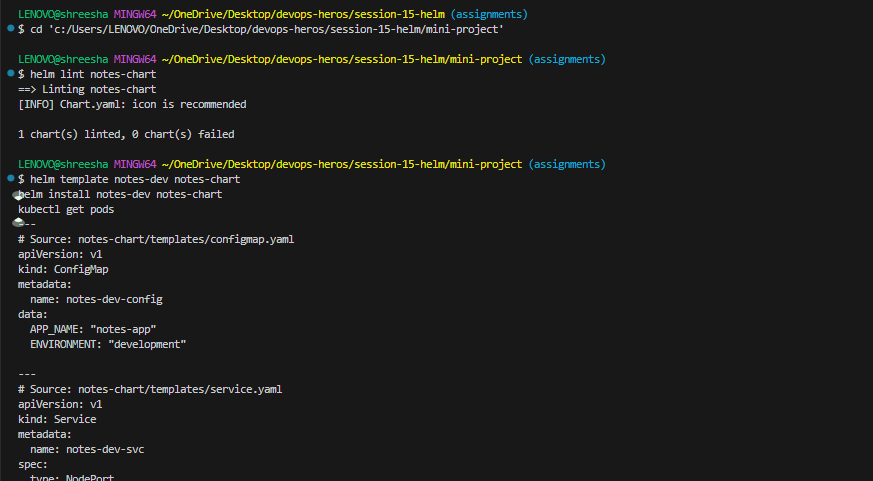

### Upgrade
*Upgraded the application using `values-prod.yaml`.*
- **Command:** `helm upgrade notes-dev notes-chart -f notes-chart/values-prod.yaml`
- **Result:** The application scaled up to 3 replicas.
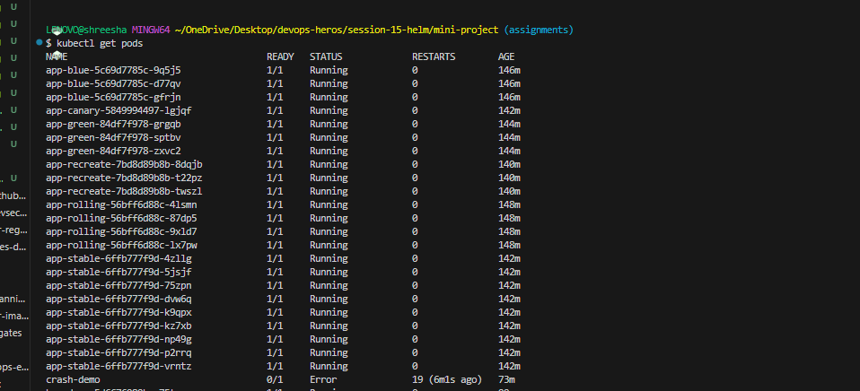
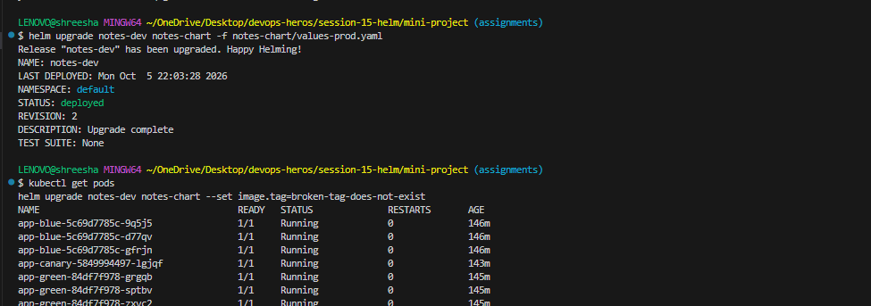

### Rollback
*Simulated a bad upgrade with an invalid image tag, and rolled back.*
- **Command:** `helm rollback notes-dev 2`
- **Result:** Successfully reverted to Revision 2, returning all 3 pods to a healthy `Running` state.
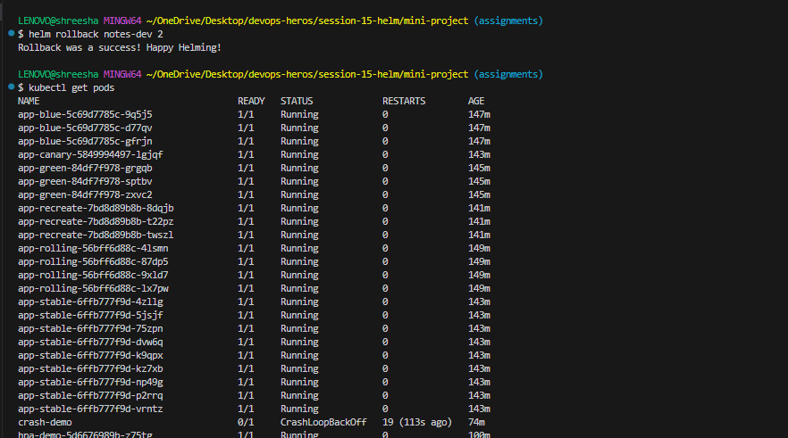

### Final Verification
*All pods were verified to be in the `Running` state before we cleaned up the release using `helm uninstall notes-dev`.*
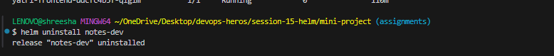

