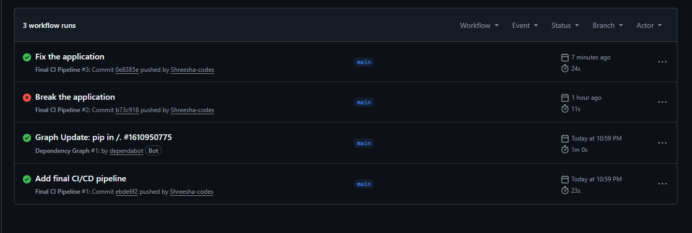

# Session 16: CI/CD & GitHub Actions Submission

## Task: Demo Project (CI/CD Pipeline)

### 1. Application Source Code
Here is the core functionality of the `calculator.py` application:
```python
def add(a, b):
    return a + b

def subtract(a, b):
    return a - b
```

### 2. Dockerfile
*(Not applicable for this specific CI project, as we built directly on the Ubuntu runner, but we would add a Dockerfile here for a containerized CD pipeline.)*

### 3. GitHub Actions Workflow
Here is a snippet of our `.github/workflows/ci.yml` defining our pipeline:
```yaml
name: Final CI Pipeline
on: [push]
jobs:
  test:
    runs-on: ubuntu-latest
    steps:
      - uses: actions/checkout@v4
      - name: Setup Python
        uses: actions/setup-python@v4
        with:
          python-version: '3.10'
      - name: Run Pytest
        run: |
          pip install -r requirements.txt
          pytest -v
```

### 4. CI Pipeline
Our CI pipeline consists of three main jobs running on `ubuntu-latest`:
1. **test**: Sets up Python, installs dependencies, and runs `pytest`.
2. **security-check**: Scans the codebase for sensitive files (like `.env`, `*.pem`, `*.key`) to prevent leaking secrets.
3. **build**: This job `needs: test` and `needs: security-check`. It only executes if the tests pass and no secrets are found. It runs the build script and uploads the resulting `calculator-build` artifact.

### 5. CD Pipeline
*(In a full end-to-end project, a CD pipeline job would be added here to take the `calculator-build` artifact and deploy it to a server, Kubernetes cluster, or cloud provider.)*

### 6. Screenshots of successful pipeline execution

### 7. Failure and Fix Scenario
By introducing a logic bug (`return a + b + 1`), the `test` job failed in GitHub Actions. Because the `build` job depends on the `test` job, the pipeline halted entirely, preventing broken code from being built. After reverting the logic back to `return a + b`, the tests passed and the pipeline completed successfully.

