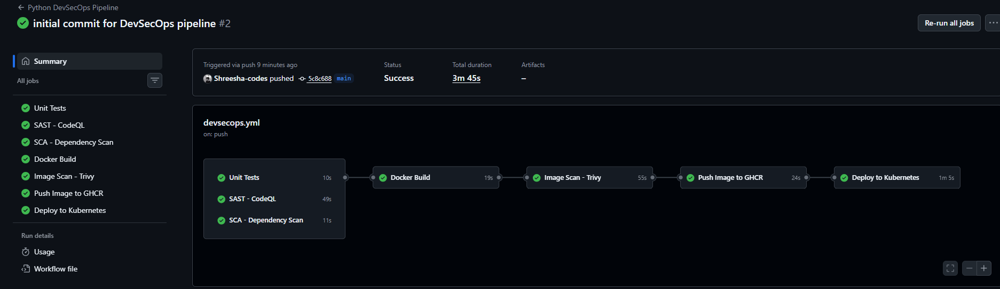
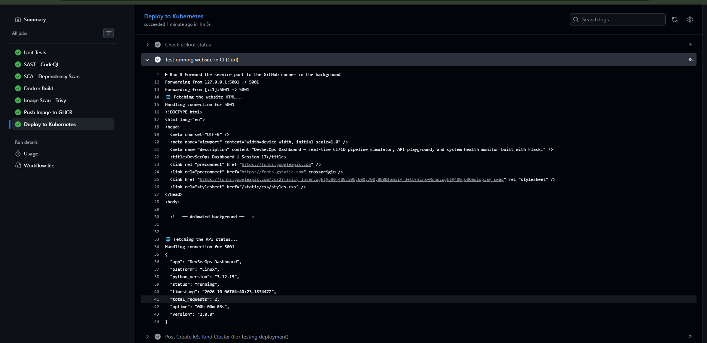

# Session 17: Complete CI/CD & DevSecOps Submission

## Task: DevSecOps Demo Project

### 1. Application Details
For this project, I used a Python Flask app called `hey-cicd`. It has a simple dashboard and a few API endpoints (like `/health` and `/api/calculate`). I used this app to practice setting up a full CI/CD pipeline from scratch, covering everything from running tests to container security and deploying to Kubernetes.

### 2. CI/CD + DevSecOps Pipeline
Here's a quick look at the `.github/workflows/devsecops.yml` file where I set up the SAST and SCA security checks:
```yaml
  sast:
    name: SAST - CodeQL
    runs-on: ubuntu-latest
    steps:
      - uses: actions/checkout@v4
      - uses: github/codeql-action/init@v3
        with: { languages: python }
      - uses: github/codeql-action/analyze@v3

  sca:
    name: SCA - Dependency Scan
    runs-on: ubuntu-latest
    steps:
      - uses: actions/checkout@v4
      - run: |
          pip install -r requirements.txt
          pip install pip-audit
          pip-audit
```

### 3. Pipeline Stages Explained
Here is a breakdown of what I configured the pipeline to do step-by-step:
- **Unit Testing**: I set it up to run `pytest` first so it catches any broken code before doing anything else.
- **SAST**: I added GitHub CodeQL to scan my Python code for security vulnerabilities.
- **SCA**: I used `pip-audit` to check if any of the packages in my `requirements.txt` have known CVEs.
- **Docker Build & Push**: Once the tests and code scans pass, it builds the Docker image and pushes it straight to my GitHub Container Registry (GHCR).
- **Container Image Scanning**: Before pushing, I made sure Trivy scans the Docker image to catch any OS or app-level vulnerabilities.
- **Kubernetes Deployment**: Finally, I used a temporary `kind` cluster right in the GitHub runner to deploy the Kubernetes manifests and run a `curl` test to verify it works.

### 4. Kubernetes Manifests
**`deployment.yaml` Snippet:**
I updated the deployment file to pull the image from my own GHCR repo:
```yaml
      containers:
        - name: session17-python
          image: ghcr.io/shreesha-codes/hey-cicd:__IMAGE_TAG__
          imagePullPolicy: Always
          ports:
            - containerPort: 5001
```

### 5. Successful Pipeline Execution
Here is the screenshot showing my full DevSecOps pipeline passing successfully:


### 6. Verification
Here is the proof that the deployment actually worked and the API responded successfully:

