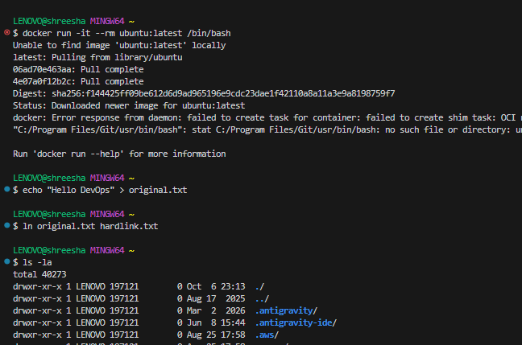
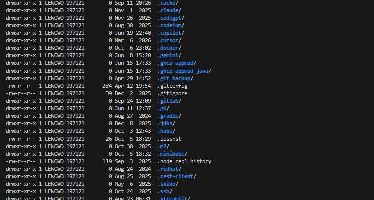
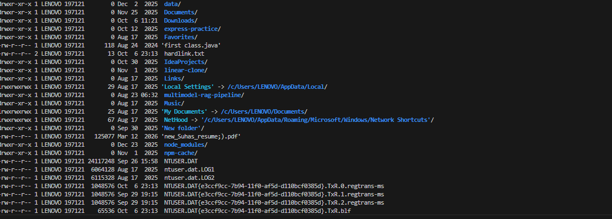
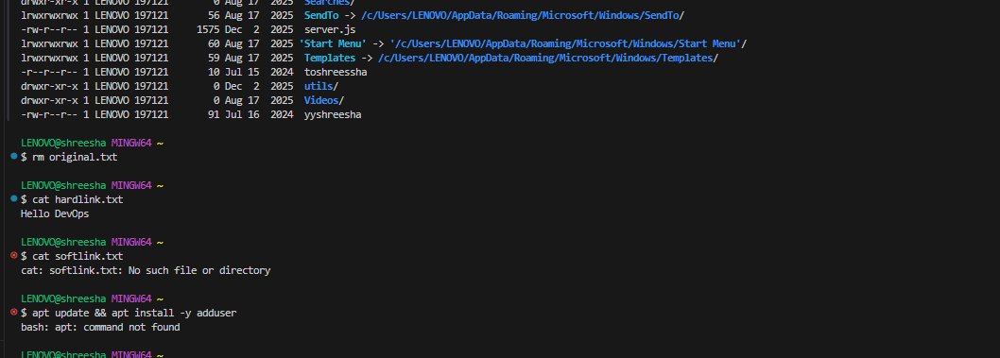

# Session 1: Linux Homework Tasks

## Task 1: Soft Link vs Hard Link
- **Soft Link (Symlink):** Acts like a shortcut in Windows. It points to the original file's path. If the original file is deleted, the soft link breaks (becomes a "dangling link").
  - *Command to create:* `ln -s /path/to/original /path/to/link`
- **Hard Link:** Points directly to the data on the hard drive (the inode). It is an exact mirror copy. If you delete the original file, the data still exists as long as the hard link exists.
  - *Command to create:* `ln /path/to/original /path/to/link`

## Task 2: adduser vs useradd
- **useradd:** This is the native, low-level binary compiled with the system. It simply creates the user but often doesn't set up the home directory or prompt for a password automatically unless you pass specific flags.
- **adduser:** This is a high-level, interactive Perl script (especially on Ubuntu/Debian). It automatically creates the home directory, prompts you for a password, and copies default bash profiles over. 
- *Preferred Command:* **`adduser`** is heavily preferred on Ubuntu because it handles all the setup interactively for you.

## Task 3: journalctl
`journalctl` is the command-line utility used to view logs collected by `systemd`. 
Instead of checking scattered text files in `/var/log`, `journalctl` gives you a centralized way to check system logs, boot logs, and specific service logs.
- *Check logs for a specific service:* `journalctl -u nginx`
- *Follow logs live:* `journalctl -u nginx -f`

## Task 4: Top 10 Most Important Daily Linux Commands
As a DevOps engineer, you will use these commands constantly:
1. **`ls -la`**: List all files (including hidden ones) with detailed permissions.
2. **`cd`**: Change directories.
3. **`grep`**: Search for specific text inside files or outputs (e.g., `cat file.txt | grep "error"`).
4. **`cat` / `less` / `tail`**: Read files. `tail -f` is especially useful for reading logs live.
5. **`chmod` / `chown`**: Change file permissions and file ownership.
6. **`top` / `htop`**: Monitor live system resources (CPU, Memory).
7. **`df -h`**: Check how much free disk space you have left.
8. **`find`**: Search for files in a directory tree.
9. **`systemctl`**: Start, stop, and check the status of services (e.g., `systemctl status docker`).
10. **`ssh`**: Securely connect to remote servers.

