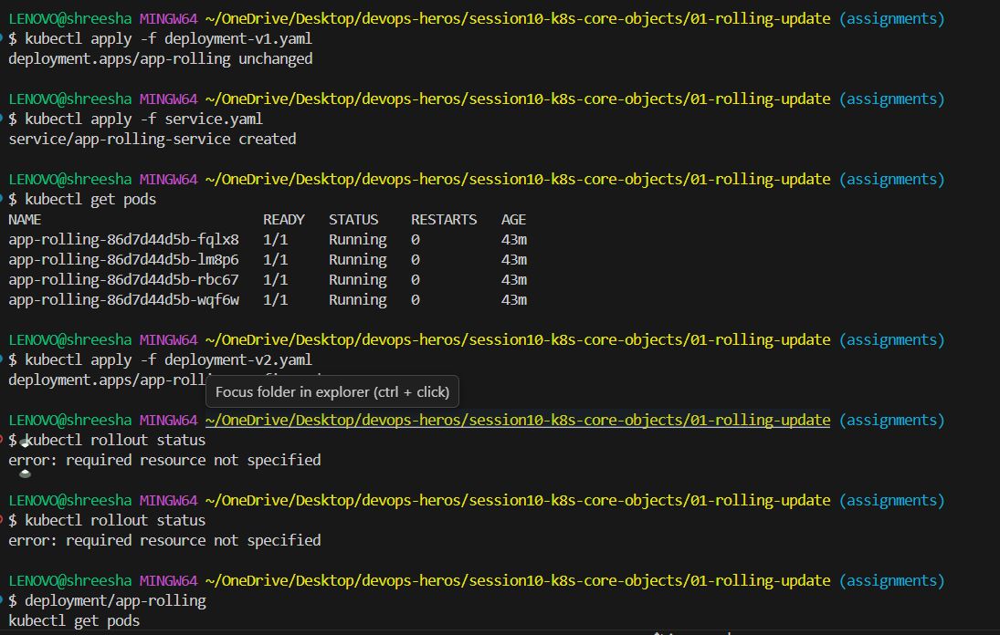
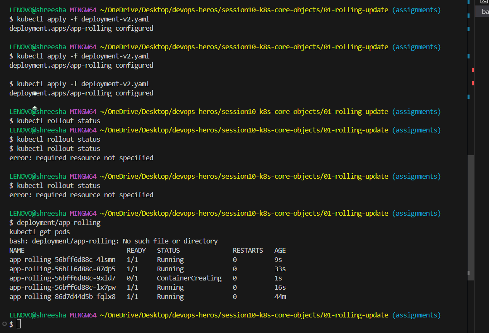
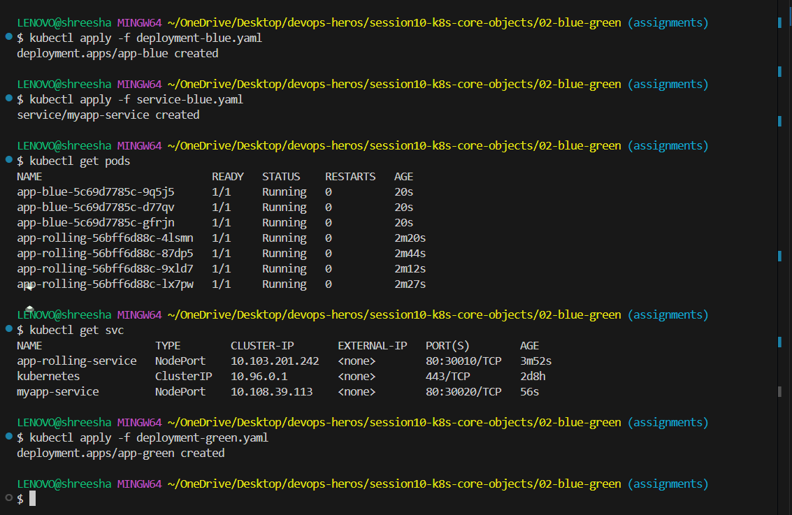
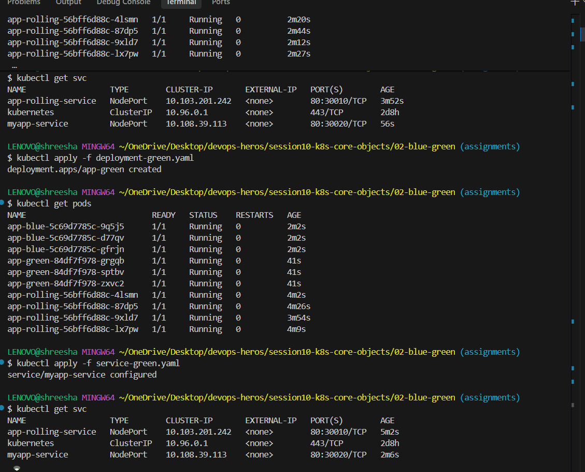
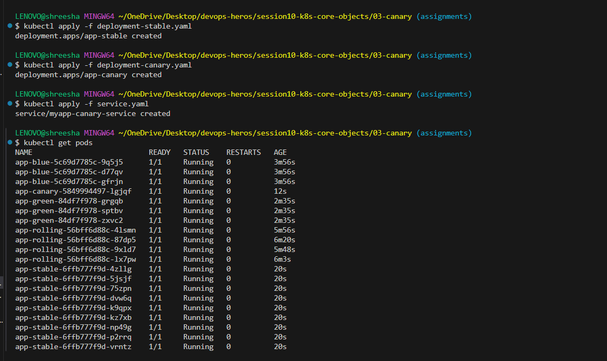
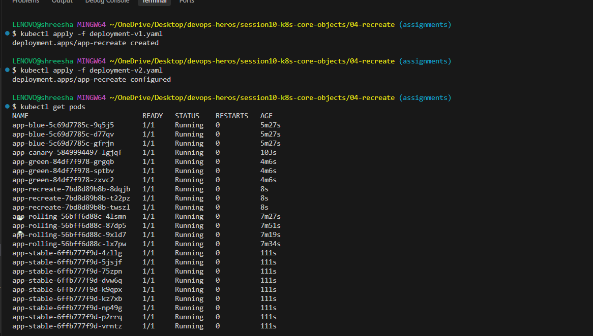
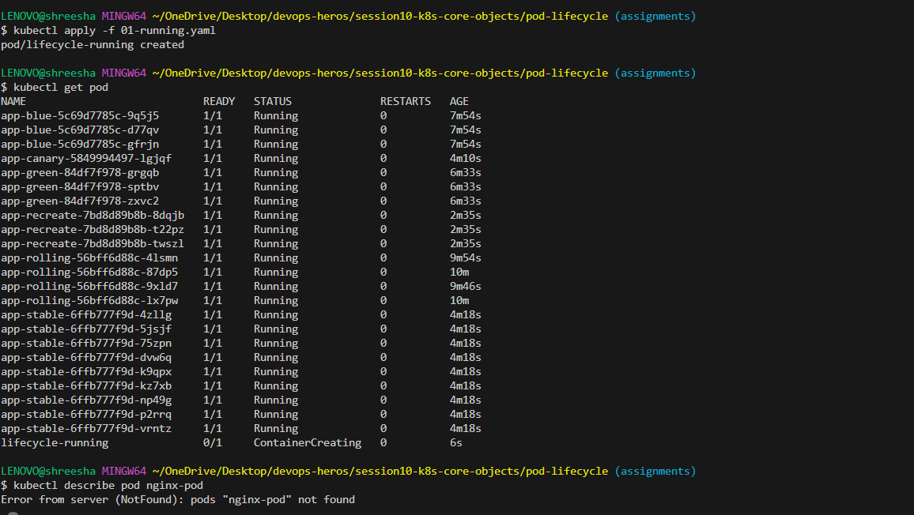
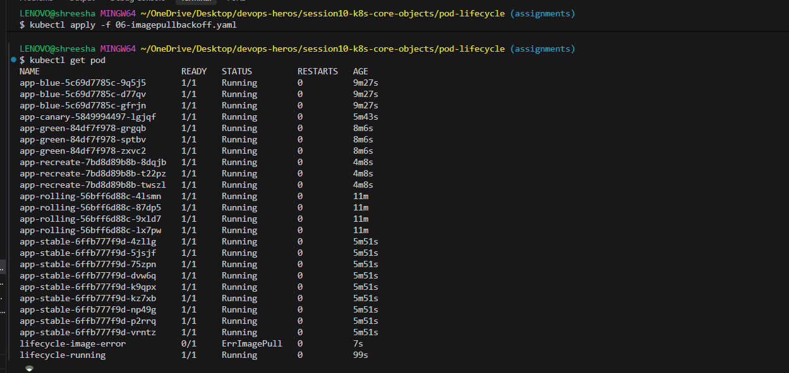

# Session 10: Kubernetes Pods, ReplicaSets & Deployments Submission

This file contains the accurate commands to run using the provided files in your folders.

---

## Task 1: Deployment Strategies

### 1. Rolling Update
```powershell
cd c:\Users\LENOVO\OneDrive\Desktop\devops-heros\session10-k8s-core-objects\01-rolling-update

# 1. Apply the initial v1 deployment and service
kubectl apply -f deployment-v1.yaml
kubectl apply -f service.yaml

# 2. Verify initial pods are running
kubectl get pods

# 3. Perform the rolling update by applying the v2 deployment
kubectl apply -f deployment-v2.yaml

# 4. Immediately check rollout status and pods to see the transition
kubectl rollout status deployment/app-rolling
kubectl get pods
```





### 2. Blue-Green Deployment
```powershell
cd c:\Users\LENOVO\OneDrive\Desktop\devops-heros\session10-k8s-core-objects\02-blue-green

# 1. Apply the Blue deployment and the service pointing to Blue
kubectl apply -f deployment-blue.yaml
kubectl apply -f service-blue.yaml

# 2. Verify Blue is active
kubectl get pods
kubectl get svc

# 3. Apply the Green deployment (new version, but no traffic yet)
kubectl apply -f deployment-green.yaml
kubectl get pods

# 4. Switch traffic to Green by applying the Green service
kubectl apply -f service-green.yaml

# 5. Verify the active version is now Green
kubectl get svc
```





### 3. Canary Deployment
```powershell
cd c:\Users\LENOVO\OneDrive\Desktop\devops-heros\session10-k8s-core-objects\03-canary

# 1. Deploy the stable version, canary version, and the service
kubectl apply -f deployment-stable.yaml
kubectl apply -f deployment-canary.yaml
kubectl apply -f service.yaml

# 2. Get all pods to show stable and canary running together
kubectl get pods
```



### 4. Recreate Deployment
```powershell
cd c:\Users\LENOVO\OneDrive\Desktop\devops-heros\session10-k8s-core-objects\04-recreate

# 1. Deploy the initial version
kubectl apply -f deployment-v1.yaml
kubectl get pods

# 2. Update to v2 and observe the old pods terminating before new ones create
kubectl apply -f deployment-v2.yaml

# 3. Immediately get pods
kubectl get pods
```



---

## Task 2: Pod Lifecycle

**1. Normal Running Pod (Pending -> Running)**
```powershell
cd c:\Users\LENOVO\OneDrive\Desktop\devops-heros\session10-k8s-core-objects\pod-lifecycle

kubectl apply -f 01-running.yaml
kubectl get pod
kubectl describe pod nginx-pod
```
**Explanation**: The pod schedules successfully, pulls the image, and transitions to `Running`.



**2. Succeeded Pod (Pending -> Running -> Succeeded)**
```powershell
kubectl apply -f 03-succeeded.yaml
kubectl get pod --watch
```
**Explanation**: The pod runs its command, finishes execution, and exits with code 0, moving to `Completed` (Succeeded) state because `restartPolicy` is Never.
*(INSERT SCREENSHOT HERE)*


**3. Failed Pod (ImagePullBackOff / ErrImagePull)**
```powershell
kubectl apply -f 06-imagepullbackoff.yaml
kubectl get pod
```
**Explanation**: The pod cannot pull the image because the tag does not exist or is invalid. It transitions to `ImagePullBackOff` and fails to run.



---

