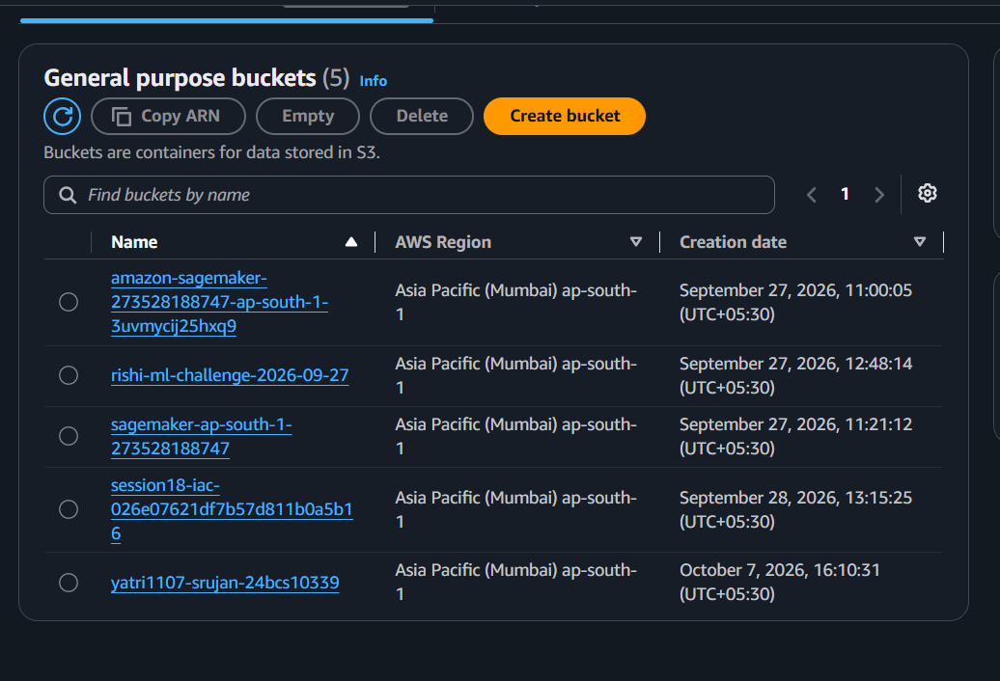
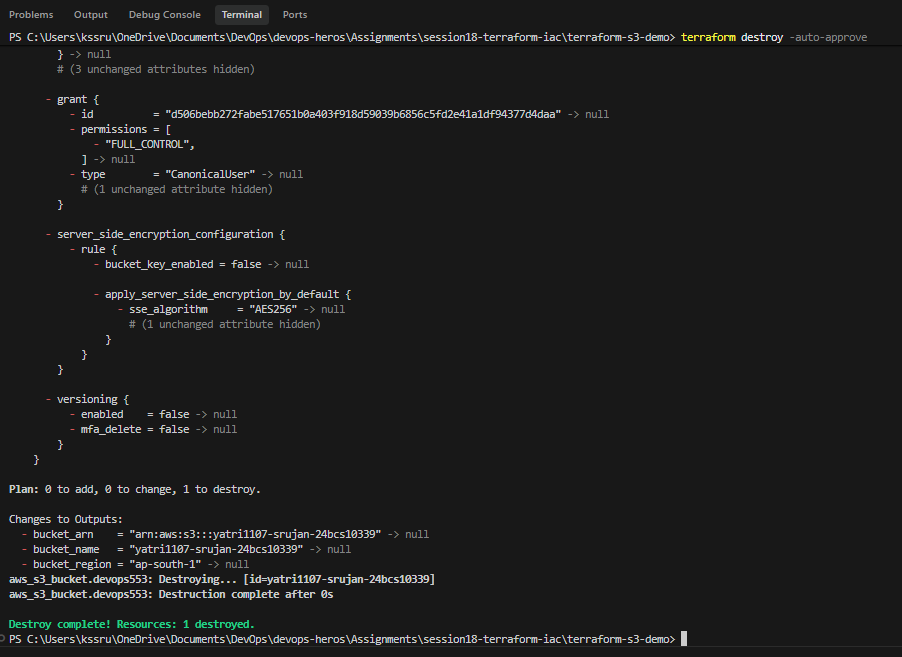

# Session 18 — Terraform & Infrastructure as Code

## Student Details
**Name:** Shreesha
**Roll Number:** 24BCS10488
**Session:** Session 18 - Terraform & Infrastructure as Code

## 1. Project Overview
Welcome to the Session 18: Terraform & Infrastructure as Code (IaC) project submission!

When people start using cloud providers like Amazon Web Services (AWS), they usually log into a website (the AWS Management Console) and click buttons to create servers, databases, and storage buckets. While that works for learning, it quickly becomes slow, error-prone, and impossible to replicate when building real-world software systems.

In this assignment, we transition to modern DevOps practices by using HashiCorp Terraform—a tool that allows us to write plain code files that automatically build, manage, and delete cloud infrastructure.

This submission is split into two main sections:

**Task 1: Terraform S3 Demo Project**: Writing code to automatically create an Amazon S3 storage bucket on AWS, inspecting its properties, and destroying it safely using Terraform commands.
**Task 2: AWS Services In-Depth Research**: A beginner-friendly yet thorough technical deep dive into five essential AWS services: IAM (Governance), EC2 (Virtual Servers), S3 (Object Storage), VPC (Private Networking), and DynamoDB & RDS (Database Solutions).

## 2. Infrastructure as Code (IaC) Explained Simply
**Note - Simple Real-World Analogy:**
Imagine baking a cake. If you bake from memory without writing anything down, every cake will taste slightly different, and if you forget an ingredient, the cake is ruined. But if you have a written recipe card, anyone can follow the exact instructions and bake the exact same cake every single time.
Infrastructure as Code is that recipe card for the cloud. Instead of manually clicking buttons on AWS, you write down your cloud setup as code. Terraform reads that recipe and builds your infrastructure reliably every single time.

### 2.1 Declarative vs. Imperative — What’s the Difference?
* **Imperative (Tell the computer HOW to do it step-by-step):** Like telling a taxi driver: "Drive 200 meters, turn left, wait 10 seconds at the signal, then turn right." If the driver misunderstands even one step, you end up lost. Scripts like Bash or PowerShell work this way.
* **Declarative (Tell the computer WHAT you want the end result to be):** Like telling a taxi driver: "Take me to Central Railway Station." The driver figures out the best route and gets you to the exact destination. Terraform is declarative: you simply declare "I want an S3 bucket named my-bucket", and Terraform handles all the complex AWS API calls to make it happen.

### 2.2 Why is Terraform So Popular?
* **Idempotence (Safe to re-run):** If you run Terraform ten times without changing your code, it won't create ten duplicate buckets. It checks what is already there and only makes changes if needed.
* **Version Control:** Since infrastructure is written in text files (.tf), you can track changes in Git, collaborate in teams, and review pull requests before deploying to the cloud.
* **Cloud Agnostic:** Terraform uses a universal language (HCL - HashiCorp Configuration Language) and can talk to AWS, Google Cloud, Microsoft Azure, Kubernetes, and hundreds of other platforms using Providers.

## 3. How Terraform Works Under the Hood
Terraform relies on three core building blocks to do its job:

```text
  ┌─────────────────────────────────────────────────────────────┐
  │                 Your Code (.tf files)                       │
  │     (The blueprint: "I want an S3 bucket in ap-south-1")    │
  └──────────────────────────────┬──────────────────────────────┘
                                 │
                                 ▼
  ┌─────────────────────────────────────────────────────────────┐
  │                    Terraform Core Engine                    │
  │  (Reads code, compares with state, creates execution plan)  │
  └──────────────┬──────────────────────────────┬───────────────┘
                 │                              │
                 ▼                              ▼
  ┌─────────────────────────────┐ ┌─────────────────────────────┐
  │    AWS Provider Plugin      │ │  State File (terraform.tfstate)
  │ (Translates to AWS API calls)│ │ (Memory of what is already  │
  └──────────────┬──────────────┘ │           built)            │
                 │                └─────────────────────────────┘
                 ▼
  ┌─────────────────────────────┐
  │    Real AWS Cloud Resource  │
  │      (Live S3 Bucket)       │
  └─────────────────────────────┘
```
* **The Provider (`provider.tf`):** Think of the provider as a translator or adapter. Terraform core doesn't inherently know how AWS works. The AWS Provider plugin translates Terraform instructions into official AWS API requests.
* **The State File (`terraform.tfstate`):** Think of the state file as Terraform's memory notebook. When Terraform creates a bucket on AWS, AWS assigns it unique IDs and ARNs. Terraform writes those details into `terraform.tfstate`. Next time you run a command, Terraform checks this notebook first so it knows what already exists.

## 4. Task 1: Terraform S3 Project Breakdown
All code files for Task 1 are stored in the project folder.

### 4.1 Project File Layout
```text
terraform-s3-demo/
├── provider.tf       # Tells Terraform to use the AWS plugin and sets the region
├── variables.tf      # Declares inputs/parameters (like bucket name and region)
├── terraform.tfvars  # Supplies the actual custom values for our variables
├── main.tf           # Defines the actual S3 bucket resource to be created
├── outputs.tf        # Specifies what information to print after creation
└── README.md         # Local documentation
```

### 4.2 Walking Through the Code Files

**1. `provider.tf` — Connecting to AWS**
This file tells Terraform which cloud provider we are talking to and which region to target:
```hcl
provider "aws" {
  region = var.aws_region
}
```
*Beginner Explanation:* Just like selecting your city on a delivery app, this tells Terraform to build our resources in AWS's Mumbai region (`ap-south-1`).

**2. `variables.tf` — Creating Reusable Parameters**
Instead of hardcoding values directly in our resource code, we define variables:
```hcl
variable "aws_region" {
  type        = string
  description = "AWS region where the S3 bucket will be created."
  default     = "ap-south-1"
}

variable "bucket_name" {
  type        = string
  description = "Name of the S3 bucket."
  default     = "yatri1107"
}
```
*Beginner Explanation:* Variables are like fill-in-the-blank forms. They allow the same code to be reused for development, testing, or production simply by changing the input values.

**3. `terraform.tfvars` — Supplying Real Values**
In AWS, S3 bucket names must be globally unique across all AWS accounts in the world. We use `terraform.tfvars` to supply our unique custom name:
```hcl
aws_region  = "ap-south-1"
bucket_name = "yatri1107-shreesha-24bcs10488"
```

**4. `main.tf` — Declaring the S3 Bucket Resource**
This is the core recipe where we declare what we want AWS to create:
```hcl
resource "aws_s3_bucket" "devops553" {
  bucket        = var.bucket_name
  force_destroy = true

  tags = {
    Name        = var.bucket_name
    Environment = "dev"
    ManagedBy   = "Terraform"
    Project     = "Session18"
  }
}
```
*Beginner Explanation:*
* `resource "aws_s3_bucket" "devops553"`: We are creating an AWS S3 bucket, and internally inside Terraform, we give this block a local nickname (`devops553`).
* `force_destroy = true`: Allows Terraform to safely clean up and delete the bucket even if files are placed inside it later.
* `tags`: Key-value labels attached to the bucket in AWS so teammates know who owns it and what project it belongs to.

**5. `outputs.tf` — Returning Helpful Information**
Once the bucket is created, we want Terraform to immediately print out its details on our screen:
```hcl
output "bucket_name" {
  type        = string
  description = "Name of the S3 bucket."
  value       = aws_s3_bucket.devops553.bucket
}

output "bucket_arn" {
  type        = string
  description = "ARN of the S3 bucket."
  value       = aws_s3_bucket.devops553.arn
}

output "bucket_region" {
  type        = string
  description = "AWS region of the S3 bucket."
  value       = aws_s3_bucket.devops553.region
}
```

## 5. The Terraform Lifecycle — Step-by-Step Execution
Here is the exact journey we executed in our terminal to build, inspect, and destroy the infrastructure, along with our verified execution screenshots.
```text
 ┌──────────────┐     ┌──────────────┐     ┌──────────────┐     ┌──────────────┐
 │  1. init     │ ──► │ 2. fmt/valid │ ──► │  3. plan     │ ──► │  4. apply    │
 │ (Setup tools)│     │(Check syntax)│     │(Preview plan)│     │ (Build on AWS│
 └──────────────┘     └──────────────┘     └──────────────┘     └──────┬───────┘
                                                                       │
 ┌──────────────┐     ┌──────────────┐     ┌──────────────┐            │
 │  7. destroy  │ ◄── │  6. output   │ ◄── │   5. show    │ ◄──────────┘
 │(Clean up AWS)│     │(Read values) │     │(Inspect state│
 └──────────────┘     └──────────────┘     └──────────────┘
```

**Step 1: Initializing Terraform (`terraform init`)**
Before Terraform can do anything, it must prepare the working directory. It reads `provider.tf`, notices we need AWS, connects to HashiCorp's registry, downloads the AWS plugin, and creates a `.terraform.lock.hcl` file.
.png)

**Step 2: Formatting Code (`terraform fmt`)**
Rewrites Terraform configuration files to a canonical format and style.

**Step 3: Validating Code (`terraform validate`)**
Validates the configuration files in a directory.


**Step 4: Creating Execution Plan (`terraform plan`)**
Creates an execution plan, letting you preview the changes that Terraform plans to make to your infrastructure.


**Step 5: Applying Changes (`terraform apply`)**
Executes the actions proposed in a Terraform plan.


**Step 6: Showing State (`terraform show`)**
Provides human-readable output from a state or plan file.


**Step 7: Viewing Outputs (`terraform output`)**
Extracts the value of an output variable from the state file.


**Step 8: Destroying Infrastructure (`terraform destroy`)**
Destroys all remote objects managed by a particular Terraform configuration.



## Task 2: AWS Services Research

### 01. IAM - Governance
**What is IAM?**
AWS Identity and Access Management (IAM) is a web service that helps you securely control access to AWS resources. You use IAM to control who is authenticated (signed in) and authorized (has permissions) to use resources.

**Users**
An IAM user is an entity that you create in AWS to represent the person or application that uses it to interact with AWS. A user consists of a name and credentials (password or access keys).

**Groups**
An IAM group is a collection of IAM users. Groups let you specify permissions for multiple users, which can make it easier to manage the permissions for those users.

**Roles**
An IAM role is an identity that you can create in your account that has specific permissions. An IAM role is similar to an IAM user, in that it is an AWS identity with permission policies that determine what the identity can and cannot do in AWS. However, instead of being uniquely associated with one person, a role is intended to be assumable by anyone who needs it.

**Policies**
A policy is an object in AWS that, when associated with an identity or resource, defines their permissions. AWS evaluates these policies when an IAM principal (user or role) makes a request.

**Permissions**
Permissions determine what users and roles can do in AWS. They are defined within policies and grant or deny access to AWS resources and actions.

**Least privilege**
The principle of least privilege is the practice of granting only the permissions required to perform a task. This is a security best practice that reduces the risk of accidental or malicious actions.

**IAM best practices**
- Lock away your AWS account root user access keys.
- Use IAM roles instead of long-term access keys for applications.
- Grant least privilege.
- Enable MFA (Multi-Factor Authentication) for privileged users.
- Use IAM Access Analyzer to generate least-privilege policies based on access activity.
- Regularly rotate access keys.

**Common use cases**
- Managing access to AWS resources for employees.
- Granting cross-account access.
- Providing permissions to AWS services (like EC2 instances needing to read from S3).
- Federating users from a corporate directory (like Active Directory) to AWS.

### 02. EC2 - Compute
**What is EC2?**
Amazon Elastic Compute Cloud (Amazon EC2) is a web service that provides secure, resizable compute capacity in the cloud. It is designed to make web-scale cloud computing easier for developers.

**AMI**
An Amazon Machine Image (AMI) provides the information required to launch an instance. You must specify an AMI when you launch an instance. You can launch multiple instances from a single AMI when you need multiple instances with the same configuration.

**Instance types**
Amazon EC2 provides a wide selection of instance types optimized to fit different use cases. Instance types comprise varying combinations of CPU, memory, storage, and networking capacity. Families include General Purpose, Compute Optimized, Memory Optimized, Accelerated Computing, and Storage Optimized.

**Key pairs**
Amazon EC2 uses public-key cryptography to encrypt and decrypt login information. Public-key cryptography uses a public key to encrypt data, and a recipient uses the private key to decrypt the data. The public and private keys are known as a key pair.

**Security Groups**
A security group acts as a virtual firewall for your EC2 instances to control incoming and outgoing traffic. Inbound rules control the incoming traffic to your instance, and outbound rules control the outgoing traffic from your instance.

**EBS**
Amazon Elastic Block Store (Amazon EBS) provides block level storage volumes for use with EC2 instances. EBS volumes behave like raw, unformatted block devices. You can mount these volumes as devices on your instances.

**Public vs private IP**
- **Public IP**: Reachable from the internet. Used for resources that need to be publicly accessible, like web servers.
- **Private IP**: Not reachable from the internet. Used for internal communication between resources within a VPC.

**Instance lifecycle**
The EC2 instance lifecycle consists of different states: pending, running, stopping, stopped, shutting-down, and terminated. You can start, stop, hibernate, reboot, and terminate your instances.

**Common use cases**
- Web hosting and web applications.
- Batch processing and big data analytics.
- Development and test environments.
- High-performance computing (HPC).
- Machine learning and AI workloads.

### 03. S3 - Storage
**What is S3?**
Amazon Simple Storage Service (Amazon S3) is an object storage service that offers industry-leading scalability, data availability, security, and performance. You can use it to store and protect any amount of data for a range of use cases.

**Buckets**
A bucket is a container for objects stored in Amazon S3. Every object is contained in a bucket. Buckets have a globally unique name.

**Objects**
Objects are the fundamental entities stored in Amazon S3. An object consists of object data and metadata. The metadata is a set of name-value pairs that describe the object.

**Storage classes**
Amazon S3 offers a range of storage classes designed for different use cases:
- S3 Standard: For general-purpose, frequently accessed data.
- S3 Intelligent-Tiering: For data with unknown or changing access patterns.
- S3 Standard-IA (Infrequent Access): For long-lived, but less frequently accessed data.
- S3 One Zone-IA: For long-lived, infrequent access, non-critical data.
- S3 Glacier (Instant, Flexible, Deep Archive): For long-term archiving.

**Versioning**
Versioning allows you to keep multiple variants of an object in the same bucket. You can use versioning to preserve, retrieve, and restore every version of every object stored in your Amazon S3 bucket, protecting against accidental deletion or overwrites.

**Lifecycle policies**
S3 Lifecycle configuration enables you to specify the lifecycle management of objects in a bucket. You can configure rules to transition objects to cheaper storage classes or expire (delete) them after a certain period.

**Encryption**
Amazon S3 provides data encryption to protect your data at rest and in transit. You can use server-side encryption (SSE-S3, SSE-KMS, SSE-C) or client-side encryption.

**Bucket policies**
Bucket policies are resource-based IAM policies that you attach to S3 buckets. They allow you to manage access to buckets and the objects in them across your entire AWS account or from other accounts.

**Common use cases**
- Backup and restore.
- Data lakes and big data analytics.
- Static website hosting.
- Media hosting and content distribution.
- Software delivery.

### 04. VPC - Networking
**What is VPC?**
Amazon Virtual Private Cloud (Amazon VPC) enables you to launch AWS resources into a virtual network that you've defined. This virtual network closely resembles a traditional network that you'd operate in your own data center, with the benefits of using the scalable infrastructure of AWS.

**CIDR**
Classless Inter-Domain Routing (CIDR) is a method for allocating IP addresses and IP routing. When you create a VPC, you assign an IPv4 CIDR block (e.g., 10.0.0.0/16).

**Subnets**
A subnet is a range of IP addresses in your VPC. You can launch AWS resources into a specified subnet. Subnets can be public, private, or VPN-only.

**Route tables**
A route table contains a set of rules, called routes, that are used to determine where network traffic from your subnet or gateway is directed.

**Internet Gateway**
An internet gateway is a horizontally scaled, redundant, and highly available VPC component that allows communication between your VPC and the internet.

**NAT Gateway**
A NAT (Network Address Translation) gateway enables instances in a private subnet to connect to the internet or other AWS services, but prevents the internet from initiating a connection with those instances.

**Security Groups**
Security groups act as a virtual firewall for associated EC2 instances, controlling both inbound and outbound traffic at the instance level.

**Network ACLs**
A network access control list (ACL) is an optional layer of security for your VPC that acts as a firewall for controlling traffic in and out of one or more subnets. It operates at the subnet level.

**Public vs private subnet**
- **Public subnet**: The subnet's route table has a route to an internet gateway, allowing resources to access the internet directly.
- **Private subnet**: The subnet's route table does not have a route to an internet gateway. Resources need a NAT gateway or NAT instance to access the internet.

### 05. DynamoDB & RDS - Database Services

**DynamoDB**
Amazon DynamoDB is a fully managed, serverless, key-value NoSQL database designed to run high-performance applications at any scale.
- **NoSQL**: NoSQL databases are non-tabular databases and store data differently than relational tables. DynamoDB is flexible and schema-less.
- **Tables**: A table is a collection of items. Like other database systems, DynamoDB stores data in tables.
- **Items**: An item is a group of attributes that is uniquely identifiable among all of the other items. It's similar to a row in a relational database.
- **Attributes**: An attribute is a fundamental data element, something that does not need to be broken down any further. It's similar to a column in a relational database.
- **Partition key**: A simple primary key, composed of one attribute known as the partition key. DynamoDB uses the partition key's value as input to an internal hash function to determine the physical storage internal to DynamoDB.
- **Sort key**: A composite primary key, composed of two attributes: the partition key and the sort key. It allows storing multiple items with the same partition key, sorted by the sort key.
- **Use cases**: Serverless applications, high-traffic web apps (e-commerce carts, session management), gaming leaderboards, IoT device data.

**RDS**
Amazon Relational Database Service (Amazon RDS) is a collection of managed services that makes it simple to set up, operate, and scale databases in the cloud.
- **Relational database**: A relational database is a collection of data items with pre-defined relationships between them. These items are organized as a set of tables with columns and rows.
- **Supported engines**: Amazon Aurora, PostgreSQL, MySQL, MariaDB, Oracle Database, SQL Server.
- **DB instances**: A DB instance is an isolated database environment in the cloud. It is the basic building block of Amazon RDS.
- **Security**: RDS provides security at multiple levels: VPC for network isolation, IAM for access control, security groups for firewall rules, and encryption at rest and in transit.
- **Backups**: RDS provides automated backups and manual DB snapshots. Automated backups allow point-in-time recovery for a specified retention period.
- **Multi-AZ**: Multi-AZ deployments provide enhanced availability and durability for DB instances. RDS automatically provisions and maintains a synchronous standby replica in a different Availability Zone.
- **Read replicas**: Read replicas allow you to elastically scale out beyond the capacity constraints of a single DB instance for read-heavy database workloads.
- **Use cases**: Traditional enterprise applications (ERP, CRM), e-commerce platforms needing complex transactions, web and mobile applications needing complex querying.
