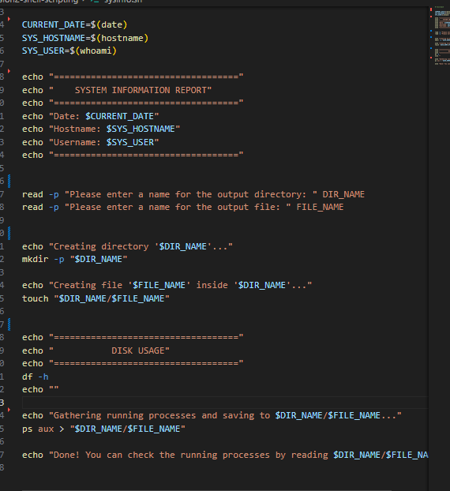
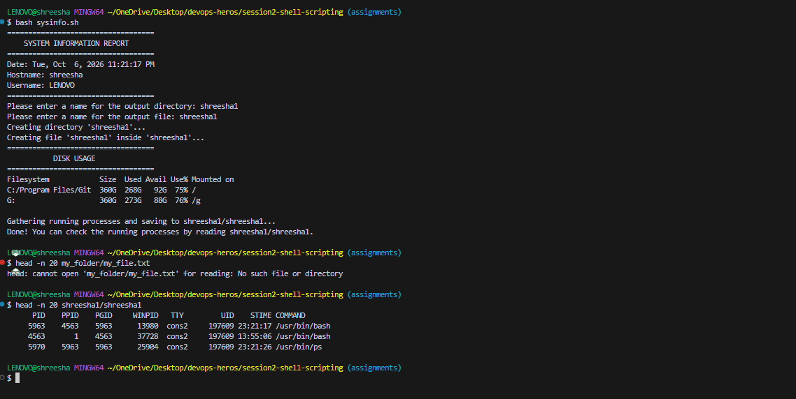
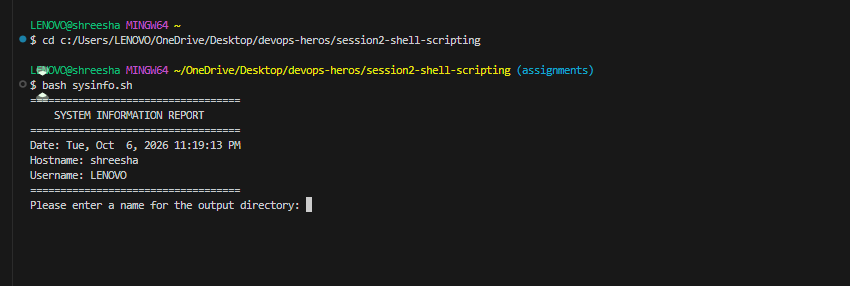

# Shell Scripting Homework

## System Information Script
I created a shell script (`sysinfo.sh`) that gathers system information, creates a directory and file based on user input, and saves the running processes to that file.

### Script Execution Output

### Contents of the output file (Running Processes)

