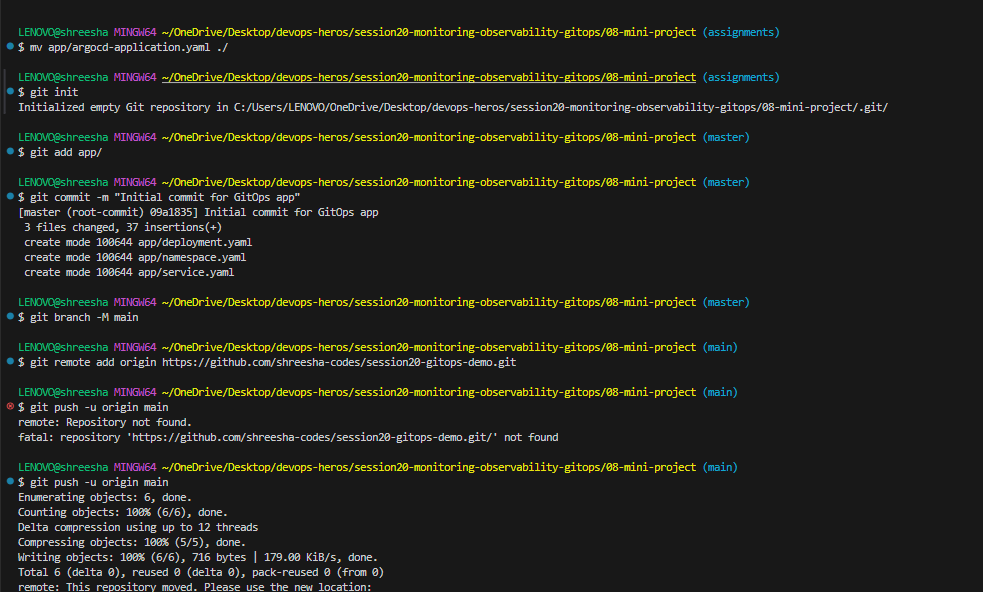
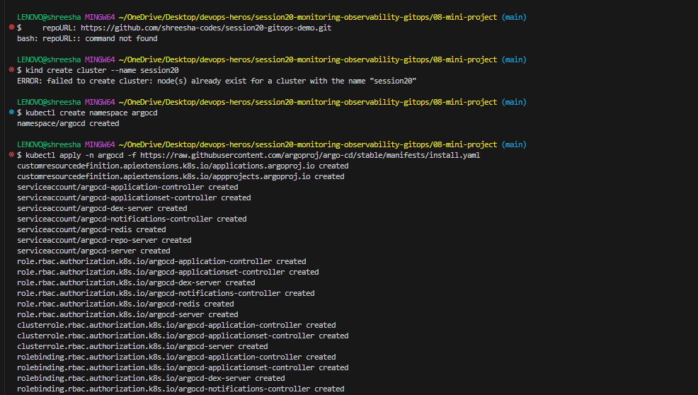
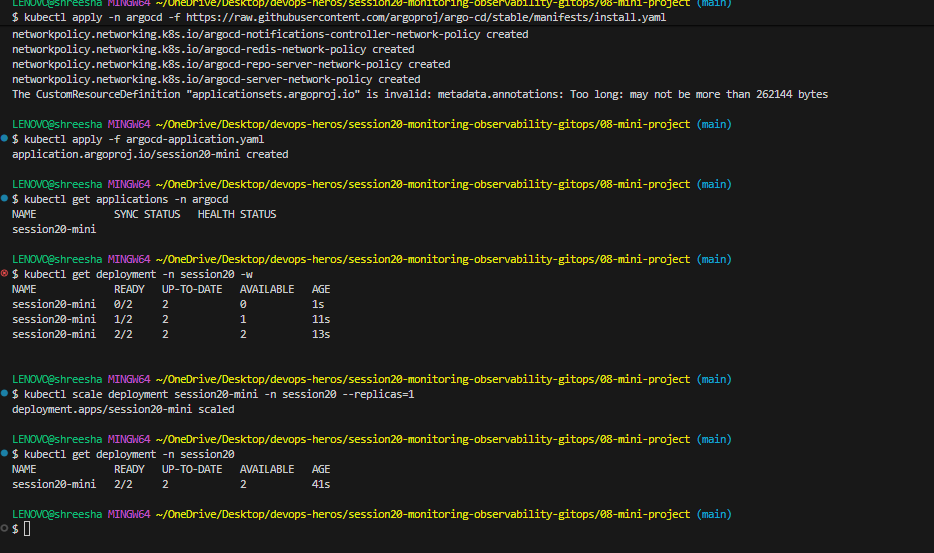
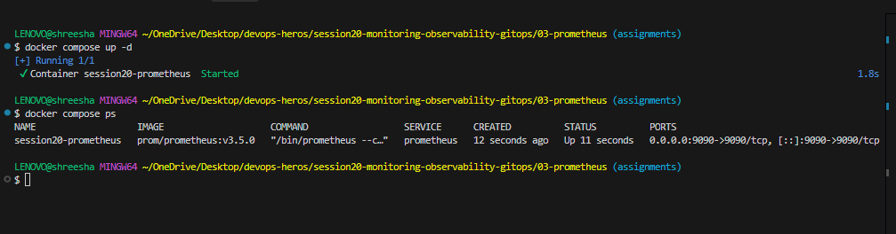
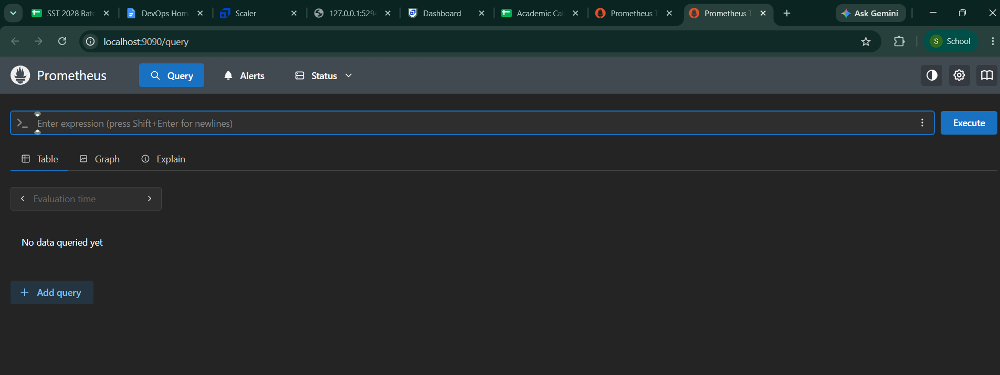
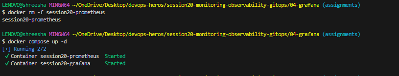
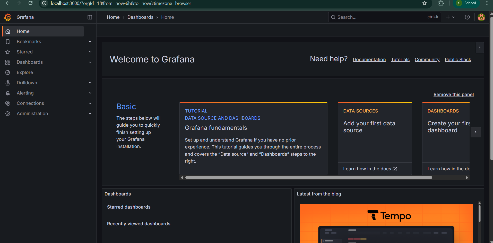
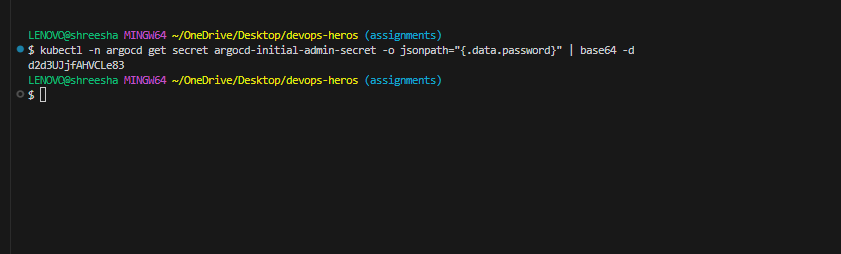
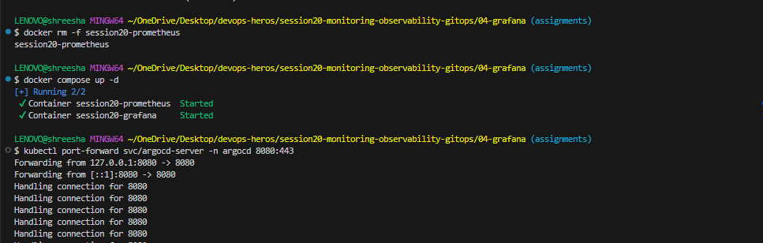
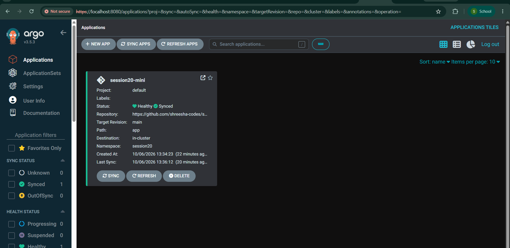

# Session 20: Monitoring, Observability & GitOps

## Task 1 & 2: Monitoring & Observability Documentation

### What I Learned About the Three Pillars of Observability
While working through this session, I learned that observability boils down to three main pillars:
1. **Metrics**: These are just numbers that tell me the current state of my system over time. For example, my CPU might be at 85%, or I might be getting 500 requests per second. I learned that Prometheus is a great tool for tracking these trends and firing off alerts when things go wrong.
2. **Logs**: These are the actual events or messages my applications spit out (like "User logged in" or "Error: Database timeout"). When my metrics tell me something broke, logs are what I look at to figure out *why* it broke. We usually use things like the ELK Stack or Loki for this.
3. **Traces**: These are super cool because they track a single request's entire journey across all my different microservices. If an API call is running slow, a trace will tell me exactly *which* service is causing the bottleneck. Tools like Jaeger are used for this.

### Why is Observability Required?
From what I've gathered, traditional monitoring just tells me "Hey, the server is down." But in complex systems like Kubernetes, that's not enough. Observability gives me the deep internal context I need to actually debug the issue and understand *why* the server went down in the first place.

---

## Task 3: GitOps Mini Project (Argo CD)

### What is GitOps?
For this mini-project, I set up a GitOps workflow. Basically, GitOps means I treat my Git repository as the single "Source of Truth" for all my infrastructure. I don't run `kubectl apply` manually anymore; I just push my code to GitHub, and the cluster updates itself.

### My GitOps Workflow Experience
1. **Desired State (Git)**: First, I wrote my Kubernetes YAML files (deployments, services) and pushed them to my GitHub repo.
2. **Reconciliation (Argo CD)**: I installed Argo CD in my cluster. Its entire job is to constantly compare the YAML files in my GitHub repo to what's actually running in Kubernetes.
3. **Actual State (Kubernetes)**: The best part was testing the self-healing. If I manually scale a deployment in the cluster (messing up the actual state), Argo CD instantly detects the "drift" and forces the cluster back to whatever state I declared in Git!

---

## Deliverables & Screenshots

### 1. Argo CD Synced Application
Here is the screenshot of my Argo CD successfully syncing with my GitHub repository:

### 2. Scaling via Git
Here is the proof that when I changed the replicas to 3 in Git and pushed, the cluster automatically scaled up:

### 3. Self-Healing Demonstration
Here is the screenshot showing how I manually scaled the deployment down to 1 in Kubernetes, but Argo CD immediately caught it and scaled it back up to 3 to match my Git repo:

---

## Task 4: Prometheus Monitoring Demo
As part of the monitoring section, I successfully spun up a Prometheus instance locally using Docker Compose to scrape metrics.

### Prometheus Container Running
Here is the screenshot of my terminal showing the Prometheus container successfully started and running:

### Prometheus UI Dashboard
Here is the screenshot of the Prometheus web interface running locally on my machine:

---

## Task 5: Grafana Monitoring Demo
To visualize the metrics collected by Prometheus, I set up a Grafana dashboard using Docker Compose.

### Grafana Dashboard UI
Here is the screenshot of my Grafana instance successfully connected to Prometheus and visualizing the metrics:

---

## Task 6: Argo CD UI Demo
While I interacted with Argo CD via the `kubectl` CLI earlier, it also comes with a powerful web interface to visualize the GitOps sync status.

### Argo CD Web Interface
Here is the screenshot of my Argo CD web interface showing the `session20-mini` application completely synchronized with my GitHub repository:

