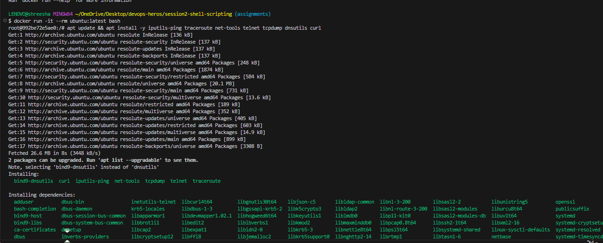
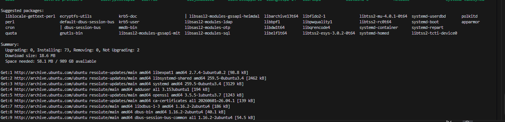
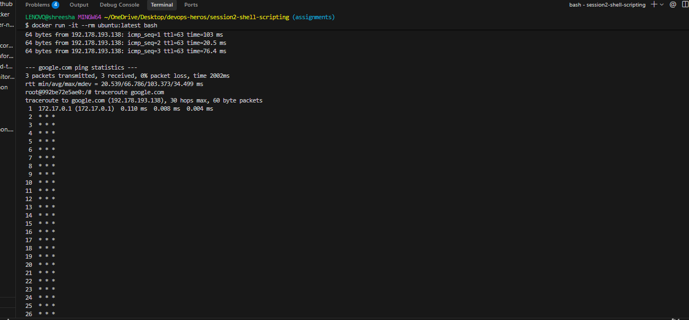
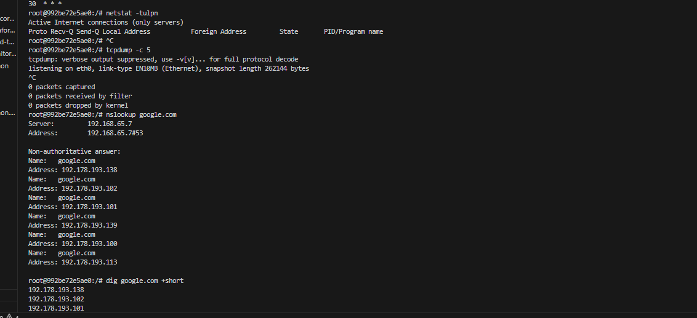
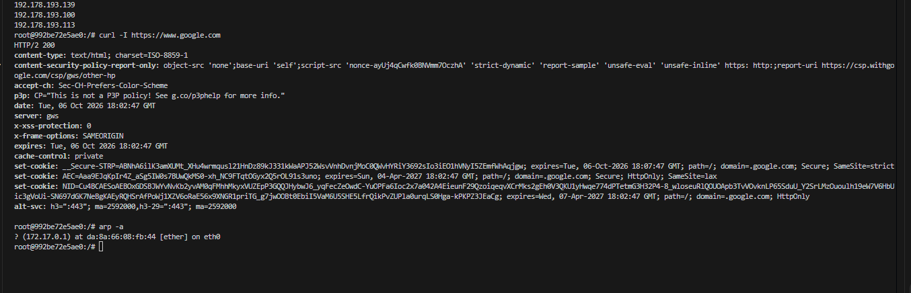

# Networking Homework Tasks

## Task 1 & 2: Practicing Networking Commands
I created this file to document my practice with the networking commands from the DevOps-Hero GitHub repo. Here are the 10 commands I executed, along with what I understood about each of them.

### 1. ping (Verify basic connectivity)
**What I understood:** This command sends ICMP echo requests to a destination. It's the most basic way to check if my machine can talk to another server on the network.
*(Paste your ping output here)*

### 2. traceroute (Identify routing path and potential delays)
**What I understood:** This command maps the exact journey my data packets take to reach their destination. It shows every router (hop) it passes through, which is great for figuring out where a connection is slowing down.
*(Paste your traceroute output here)*

### 3. netstat (Check local network connections)
**What I understood:** This command shows me all the active network connections and listening ports on my computer. It's really useful to check if a specific service is actually running and listening for traffic.
*(Paste your netstat output here)*

### 4. telnet (Test connectivity to specific ports)
**What I understood:** Even though it's an old protocol, I can use telnet to check if a specific port on a remote server is open and accepting connections, like testing port 80 for a web server.
*(Paste your telnet output here)*

### 5. tcpdump (Capture and analyze network traffic)
**What I understood:** This is a packet sniffer. It captures the actual network traffic going in and out of my machine. It's a bit overwhelming to read, but incredibly powerful for deep troubleshooting.
*(Paste your tcpdump output here)*

### 6. nslookup (Query DNS and get the IP address of a domain)
**What I understood:** I use this to manually ask a DNS server to resolve a domain name (like google.com) into its actual IP address. It helps verify if my DNS is working properly.
*(Paste your nslookup output here)*

### 7. dig (Provides detailed DNS query information)
**What I understood:** This is like a more advanced version of nslookup. It gives me a lot more detail about the DNS records, including the time it took to resolve and the specific name servers used.
*(Paste your dig output here)*

### 8. curl (Test HTTP/HTTPS connectivity)
**What I understood:** I can use this to fetch data from URLs right in the terminal. It's great for checking if a web API is responding or if a website is returning the correct HTTP status codes.
*(Paste your curl output here)*

### 9. arp (Manage ARP table entries)
**What I understood:** This command shows me the mapping between IP addresses and physical MAC addresses on my local network. It helps my computer know exactly which piece of hardware to send data to.
*(Paste your arp output here)*

### 10. systemctl (Ensure network services are running properly)
**What I understood:** While not strictly a networking command, it's essential for networking because I use it to check the status of services to ensure the background network tools are actually running.
*(Paste your systemctl output here)*

