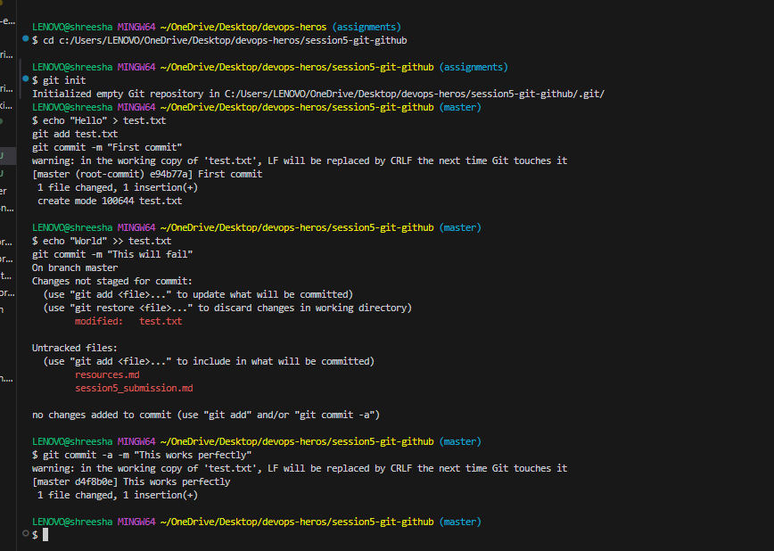
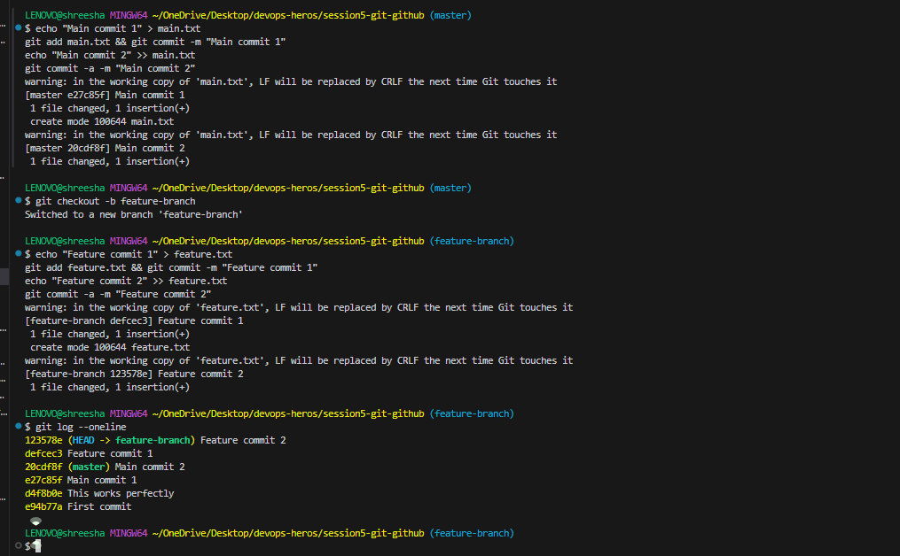
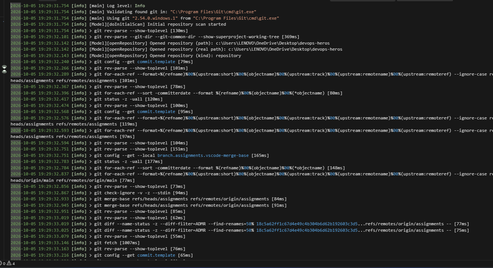
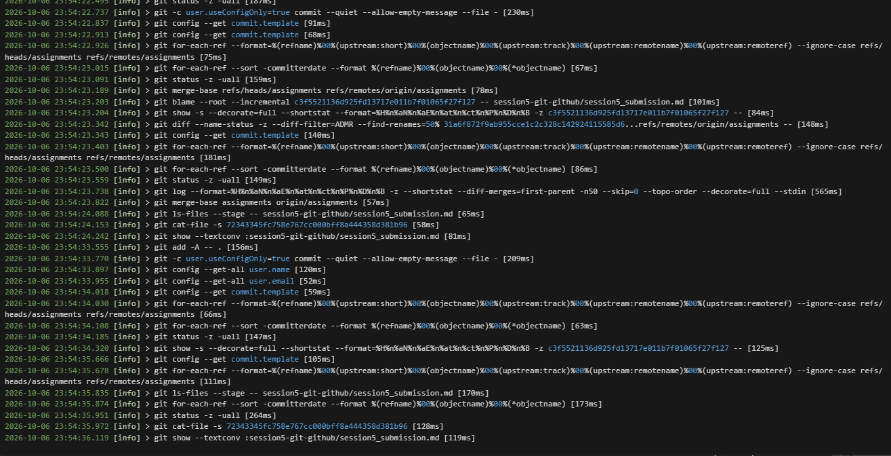

# Session 5: Git Homework Tasks

## Task 1: `git commit -a -m` vs `git commit -m`

**What I understood from testing:**
- **`git commit -m "message"`**: This command only commits files that have already been staged (added to the staging area using `git add`). If I modify a file but forget to run `git add`, this command will ignore it!
- **`git commit -a -m "message"`**: The `-a` flag stands for "all". This command automatically stages every modified and deleted file before committing. It saves me from having to type `git add .` first! However, it does *not* automatically stage brand new, untracked files.

---

## Task 2: Git Cherry-Pick

I successfully created a branch, made some commits, and cherry-picked a specific commit back into the main branch without merging the entire branch. 

**Steps I took:**
1. Created commits on `main`.
2. Created a `feature-branch` and added new commits.
3. Used `git log` to find the specific commit hash I wanted.
4. Switched back to `main` and ran `git cherry-pick <commit-hash>`.
5. Verified the commit was successfully copied over!

### Cherry-Pick Verification

