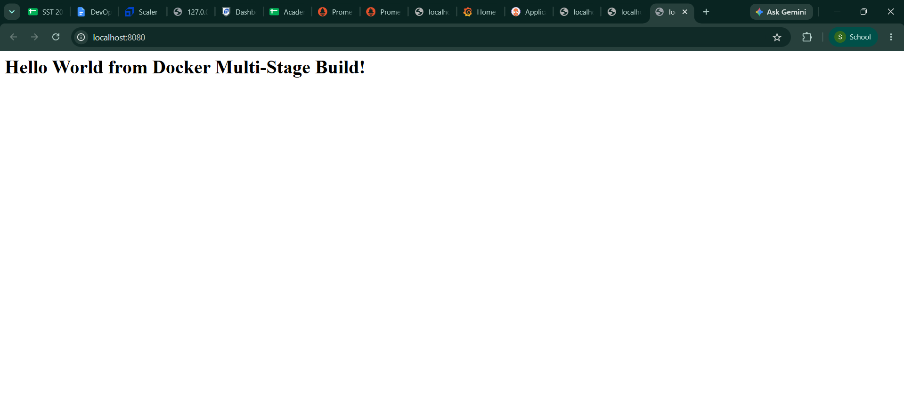
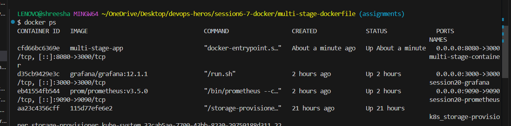
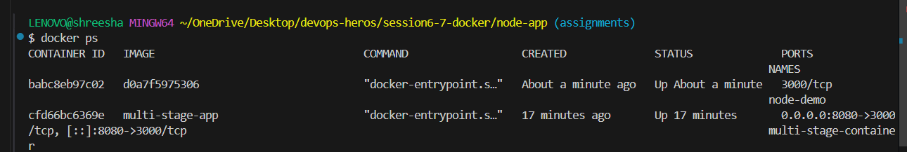
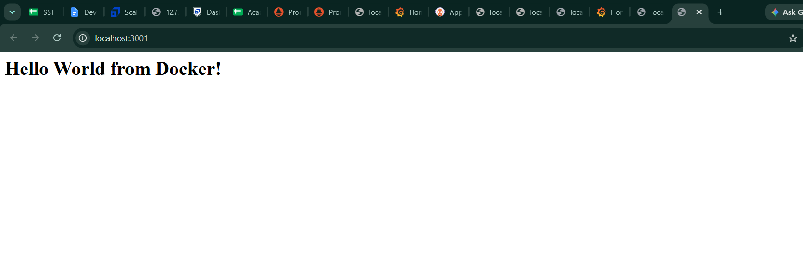
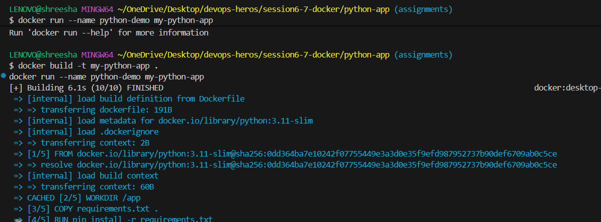
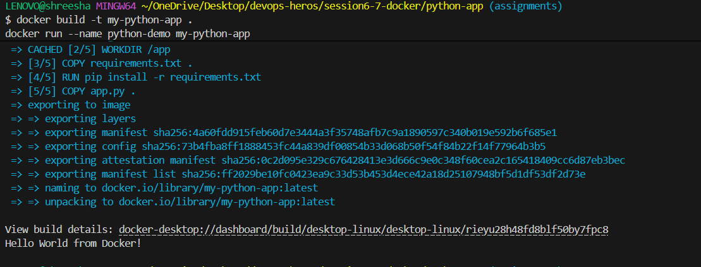
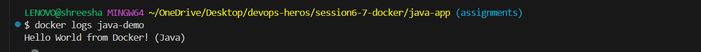

# Session 7: Docker Multi-Stage Build Homework

## Task 2: Documentation
- **Name:** Shreesha
- **Enrollment Number:** 10488
---

## Task 1: Multi-Stage Dockerfile Execution
I successfully built and ran the multi-stage Docker container for the Node.js application.

### 1. Application Running Successfully in Browser (Port 8080)

### 2. Running Container Verified via CLI

---

## Task 3: Docker Application Deployment
I deployed 3 different types of applications using Docker to demonstrate versatility in containerizing different tech stacks.

### 1. Node.js Application

### 2. Python Application

### 3. Java Application

