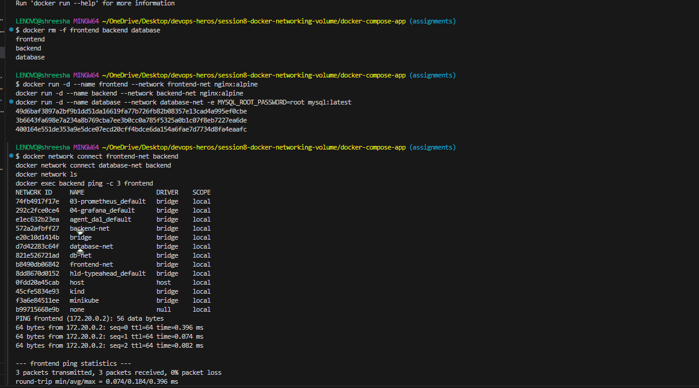
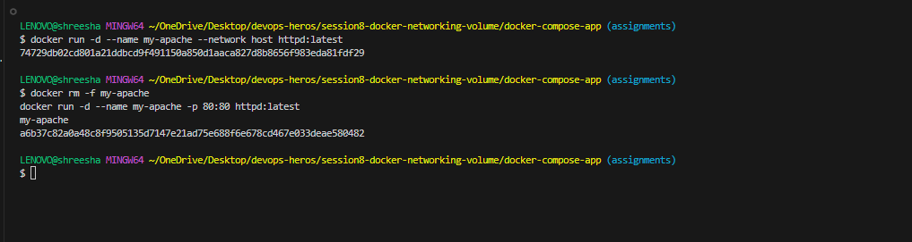
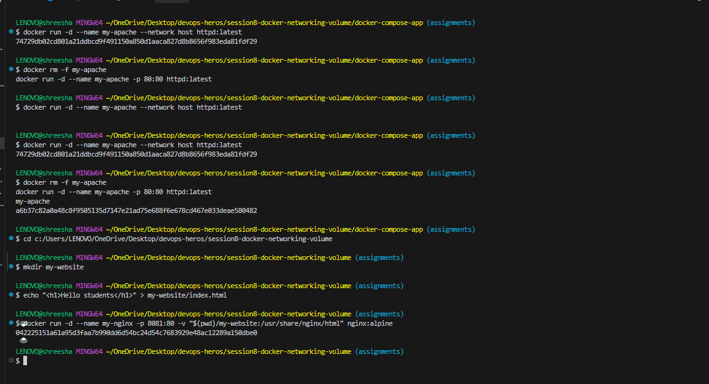

# Session 8: Docker Networking & Volume Homework

## Task 1: Docker Container Networking
I successfully created 3 separate containers (Frontend, Backend, Database) and 3 different Docker networks. I attached the Backend container to two different networks so it could communicate with both the Frontend and the Database.

### Network Setup & Connectivity Test

---

## Task 2: Host Network
I pulled the Apache2 image and ran a container using the host's networking stack (`--network host`).

### Apache Website on Host Network

---

## Task 3: Bind Mount
I created a local folder with an `index.html` file and bind-mounted it to an Nginx container. I verified that changes made to the file locally instantly update inside the container without restarting it.

### 1. Initial Bind Mount
*(Attach a screenshot here showing the Nginx page displaying "Hello students")*

### 2. Live Update (No Restart Required)
*(Attach a screenshot here showing the page displaying your updated text after modifying the local HTML file)*

---

## Task 4: Overlay Network Research
**What is an Overlay Network?**
A Docker overlay network is a distributed network that spans across multiple Docker daemon hosts. It allows containers connected to it (even if they are on entirely different physical servers) to communicate securely with each other as if they were on the same local machine.

**Use Cases:**
- **Docker Swarm:** Overlay networks are the default way Swarm services communicate with each other across different nodes.
- **High Availability:** When deploying a distributed database or a microservice architecture across multiple VMs, an overlay network ensures the microservices can resolve and talk to each other seamlessly without exposing their ports to the public internet.
