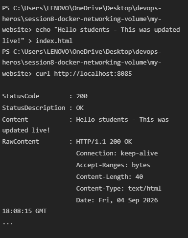

## Task 1 
Create 3 containers:
Frontend,
Backend,
Database

# use Nginx or Alpine images for the frontend and backend.

### Use the MySQL image for the database.

### Create 3 different Docker networks.

### Add the backend container to 2 networks.

### Check connectivity between the containers

## Task 2 
Pull the latest Apache 2 image from Docker Hub.
Run an Apache 2 container using the host network.
Open http://localhost in your browser. You should see the default Apache 2 page.
Try to create a Dockerfile with a simple index.html file.

## Task 3 
Create a folder on your host and add a simple index.html file inside it. 
Use the bind mount option -v to mount that folder with the container’s document root. 
Update the HTML file and see it reflected in the container without restarting it. 

## Task 3 after update

## Task 4: Overlay Network

### What is a Docker Overlay Network?
A Docker overlay network is a distributed network that spans across multiple Docker daemon hosts. It allows containers connected to it (such as those in a Docker Swarm service) to communicate securely and directly with each other, even if they are hosted on entirely different physical machines.

### Use Cases:
- **Multi-Host Networking:** The primary use case is connecting containers running on different hosts within a Docker Swarm or Kubernetes cluster.
- **High Availability & Service Discovery:** It allows services to scale across multiple nodes while maintaining seamless communication and built-in load balancing.
- **Isolation:** You can isolate different applications and environments (e.g., staging vs. production) across a cluster by keeping them on separate overlay networks.

### How Overlay Networks Work Across Multiple Hosts:
Overlay networks operate by encapsulating the container's network traffic into a different format (usually VXLAN - Virtual eXtensible Local Area Network). 
1. When Container A on Host 1 wants to talk to Container B on Host 2, it sends standard network packets.
2. The Docker engine intercepts these packets and encapsulates them into UDP packets.
3. These UDP packets are sent across the underlying physical network from Host 1 to Host 2.
4. Host 2 receives the UDP packets, unpackages them, and delivers the original network packets to Container B.

This creates a virtual, private subnet that the containers see as a single, contiguous network, completely abstracting away the underlying physical network topology of the servers.

