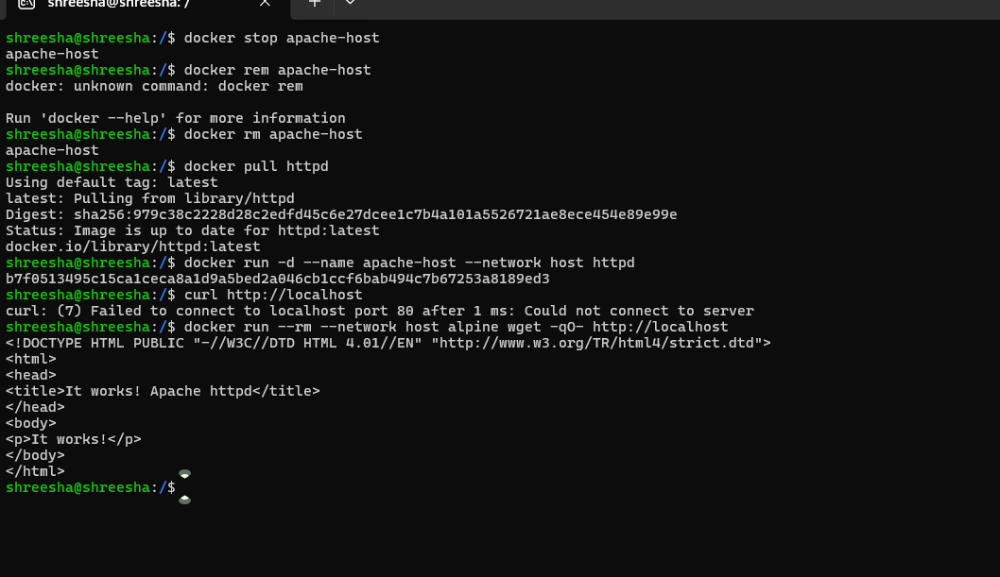
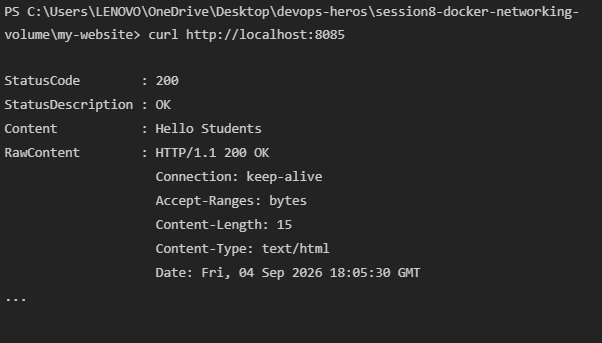
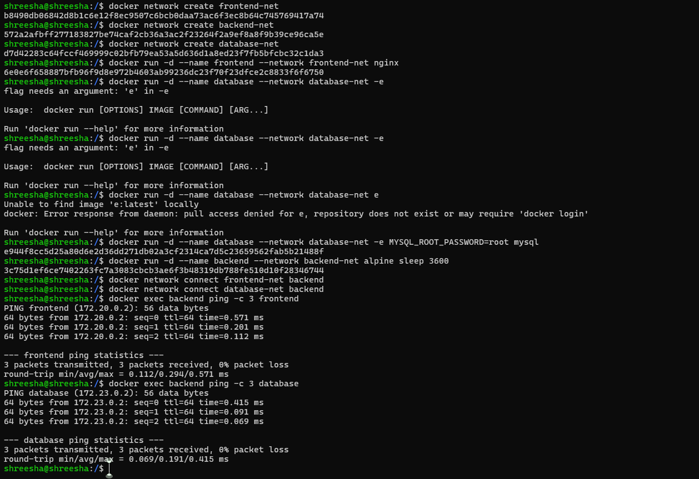

## Task 1: Docker Container Networking

**Commands Used:**
```bash
docker network create frontend-net
docker network create backend-net
docker network create database-net

docker run -d --name frontend --network frontend-net nginx
docker run -d --name database --network database-net -e MYSQL_ROOT_PASSWORD=root mysql
docker run -d --name backend --network backend-net alpine sleep 3600

docker network connect frontend-net backend
docker network connect database-net backend

docker exec backend ping -c 3 frontend
docker exec backend ping -c 3 database
```


## Task 2: Host Network

**Commands Used:**
```bash
docker pull httpd
docker run -d --name apache-host --network host httpd
docker run --rm --network host alpine wget -qO- http://localhost
```




## Task 3: Bind Mount (Before Update)

**Commands Used:**
```bash
mkdir my-website
cd my-website
echo "Hello Students" > index.html
docker run -d --name nginx-bind -p 8085:80 -v ${PWD}:/usr/share/nginx/html nginx
curl http://localhost:8085
```




## Task 3: Bind Mount (After Update)

**Commands Used:**
```bash
echo "Hello students - This was updated live!" > index.html
curl http://localhost:8085
```




## Task 4: Overlay Network

### What is a Docker Overlay Network?
A Docker overlay network is a distributed network that spans across multiple Docker daemon hosts. It allows containers connected to it (such as those in a Docker Swarm service) to communicate securely and directly with each other, even if they are hosted on entirely different physical machines.

### Use Cases:
- **Multi-Host Networking:** The primary use case is connecting containers running on different hosts within a Docker Swarm or Kubernetes cluster.
- **High Availability & Service Discovery:** It allows services to scale across multiple nodes while maintaining seamless communication and built-in load balancing.
- **Isolation:** You can isolate different applications and environments (e.g., staging vs. production) across a cluster by keeping them on separate overlay networks.

### How Overlay Networks Work Across Multiple Hosts:
Overlay networks operate by encapsulating the container's network traffic into a different format (usually VXLAN - Virtual eXtensible Local Area Network). 
1. When Container A on Host 1 wants to talk to Container B on Host 2, it sends standard network packets.
2. The Docker engine intercepts these packets and encapsulates them into UDP packets.
3. These UDP packets are sent across the underlying physical network from Host 1 to Host 2.
4. Host 2 receives the UDP packets, unpackages them, and delivers the original network packets to Container B.

This creates a virtual, private subnet that the containers see as a single, contiguous network, completely abstracting away the underlying physical network topology of the servers.
