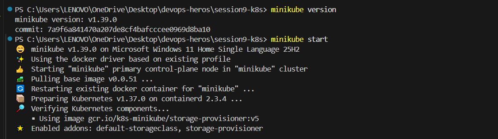
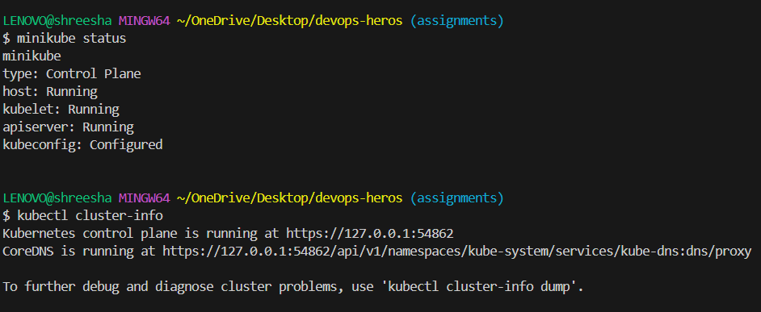
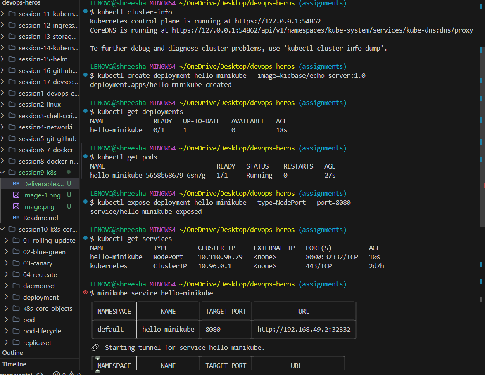
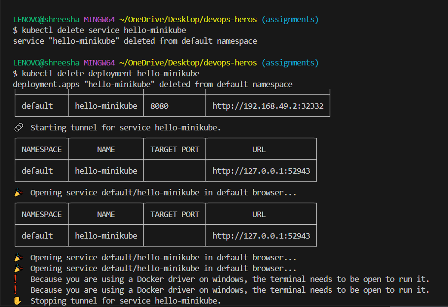
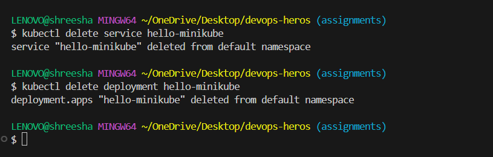

# Kubernetes Basics & Minikube Setup

## 1. Install and Configure Minikube
To install Minikube on Windows, you can use the Windows Package Manager (winget):
```powershell
winget install minikube
```
Once installed, start the Minikube cluster:
```powershell
minikube start
```

## 2. Verify Kubernetes Cluster Status
After Minikube has started, run the following commands and take screenshots of the output:
```powershell
# Check minikube status
minikube status

# Check the cluster info
kubectl cluster-info

# View the nodes in your cluster
kubectl get nodes
```

## 3. Kubernetes Architecture Notes
* **Control Plane (Master Node):** Manages the cluster. It includes components like the API Server (frontend for k8s), etcd (key-value store for cluster state), Scheduler (assigns pods to nodes), and Controller Manager (maintains cluster state).
* **Worker Nodes:** Machines (VMs or physical) that run your applications. They contain:
  * **Kubelet:** An agent that ensures containers are running in a Pod.
  * **Kube-proxy:** Maintains network rules for communication.
  * **Container Runtime:** Software that runs containers (e.g., Docker, containerd).
* **Pod:** The smallest deployable computing unit in Kubernetes, which can contain one or more containers.

## 4. Basic Kubernetes Objects and Commands & 5. Hands-on
Run these commands to perform a basic hands-on deployment (take screenshots of these as well):

```powershell
# Create a sample deployment
kubectl create deployment hello-minikube --image=kicbase/echo-server:1.0

# Verify the deployment and pods
kubectl get deployments
kubectl get pods

# Expose the deployment as a service so it can be accessed
kubectl expose deployment hello-minikube --type=NodePort --port=8080

# Verify the service
kubectl get services


# Access the application (this will open it in your browser)
minikube service hello-minikube

# Clean up / Delete the resources
kubectl delete service hello-minikube
kubectl delete deployment hello-minikube
```





## 6. Push Work to GitHub
Once you have run these commands and collected your screenshots in this directory, push your work to your assignments branch:
```powershell
git add .
git commit -m "Complete session 9 Kubernetes tasks"
git push origin assignments
```
