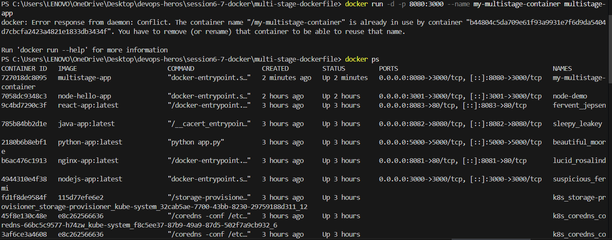
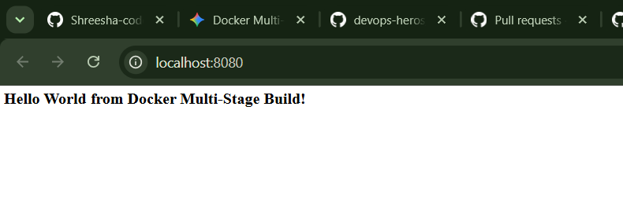
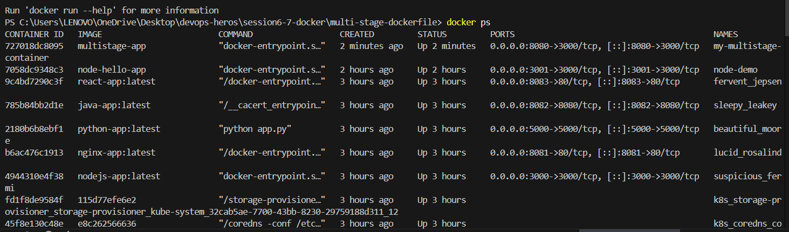
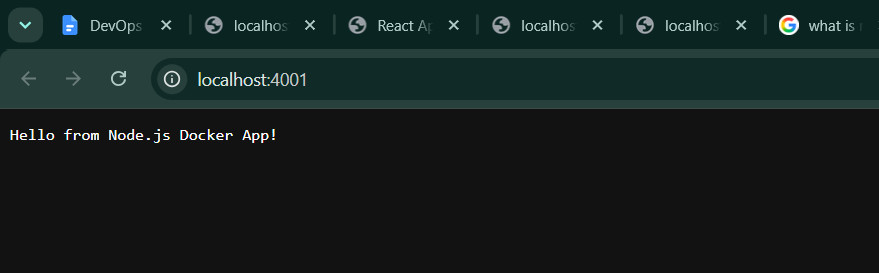
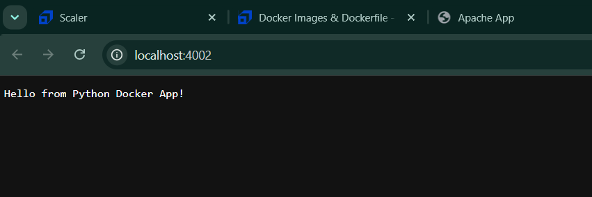

# Docker Multi-Stage Build Homework

**Name:** Shreesha Sathish
**Enrollment Number:** 24bcs10488

## Task 1: Run Multi-Stage Dockerfile

**1. Application running successfully:**

**2. `docker ps` output showing container on port 8080 (or 3000):**

## Task 3: Docker Application Deployment
*Deploy at least 3 different types of applications using Docker*

**1. Node.js Application**

**2. Python Application**

**3. Java (or Go) Application**
[Insert Output/Screenshot of Java/Go app running]
